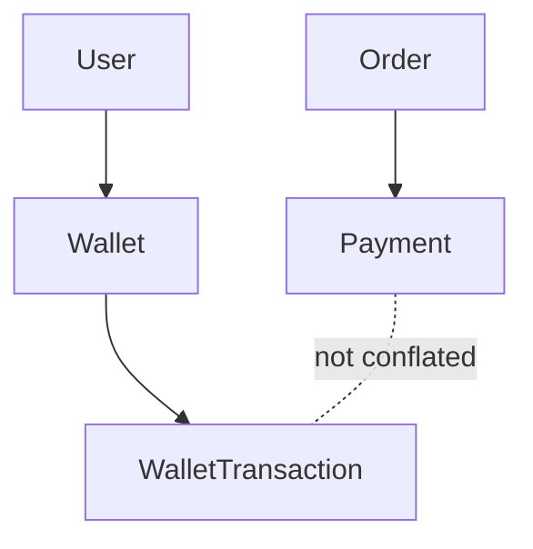

# Domain Model Notes

## Wallet

Task 48 adds `Wallet` and `WalletTransaction` to the domain model.

- `User` has at most one wallet.
- `Wallet.balance` is the current materialized balance.
- `WalletTransaction` is the immutable ledger.
- Balance-changing application services persist the wallet update and ledger append atomically.
- Payment records are not wallet transactions.

