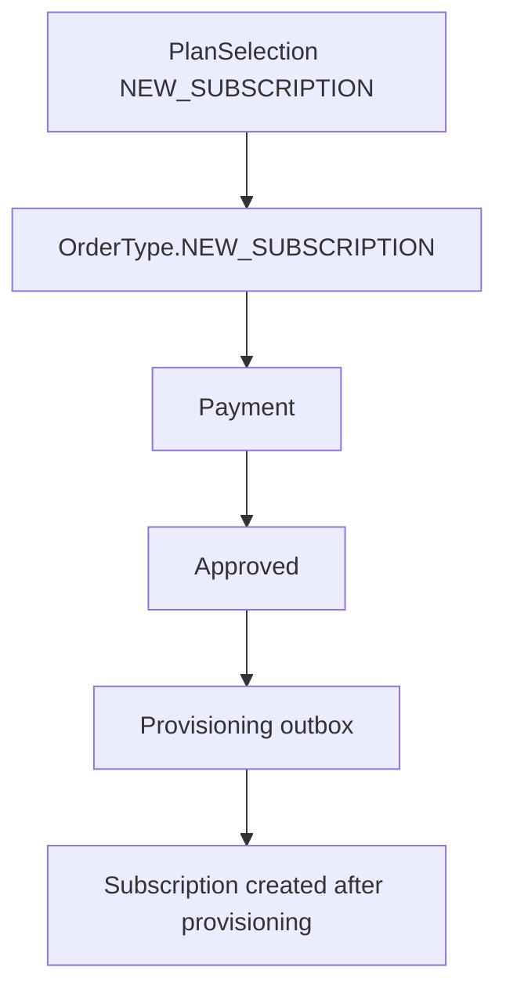
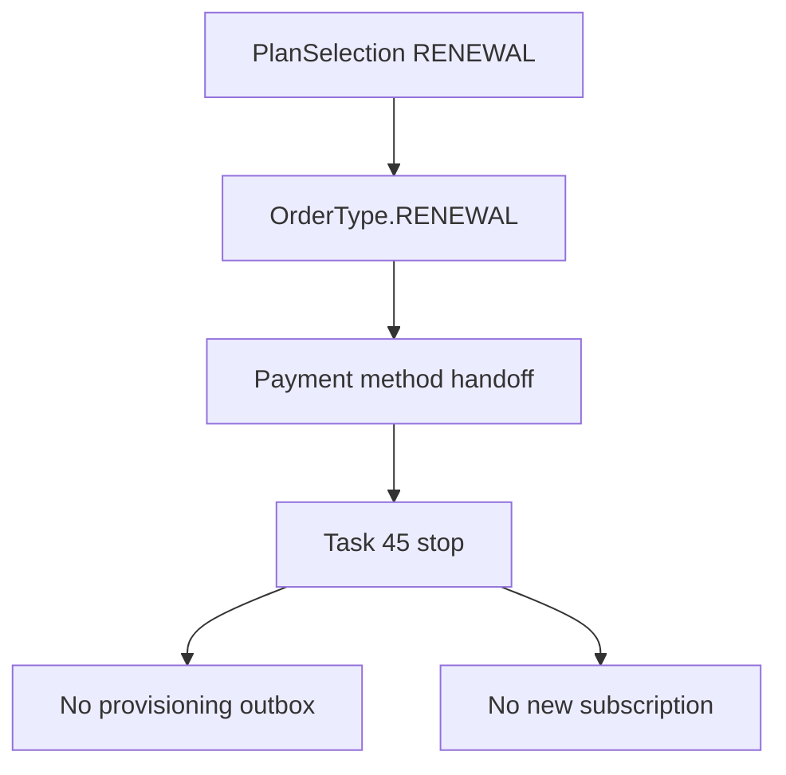

# Order Lifecycle

Orders are the payment source of truth.

New subscription:



Renewal in Task 45:



Dispatch rule:

```text
OrderType.NEW_SUBSCRIPTION -> existing new-service provisioning
OrderType.RENEWAL -> renewal path not implemented in Task 45
```
