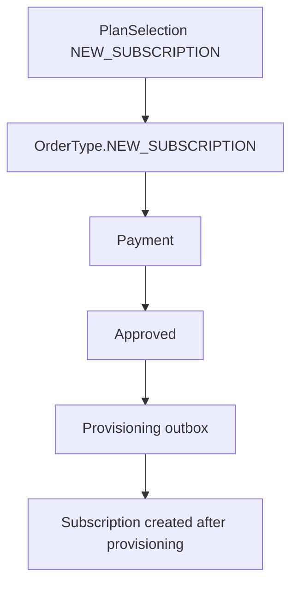
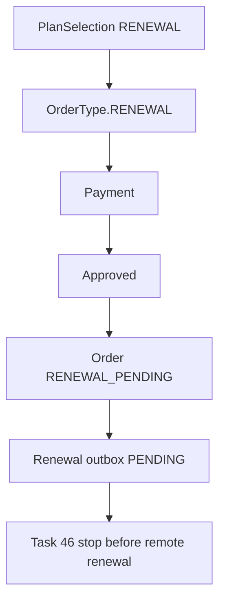

# Order Lifecycle

Orders are the payment source of truth.

New subscription:



Renewal after Task 46:



Dispatch rule:

```text
OrderType.NEW_SUBSCRIPTION -> existing new-service provisioning
OrderType.RENEWAL -> renewal outbox only
```

Renewal orders must never enter the new-subscription provisioning worker. A renewal in `RENEWAL_REVIEW_REQUIRED` means payment is approved but the target failed safety validation and needs operator review.

After Task 47, a paid Renewal Order moves from `RENEWAL_PENDING` to `COMPLETED` only when the existing remote client is updated and verified. Unsafe execution states move to `RENEWAL_REVIEW_REQUIRED`; approved payment remains auditable.
