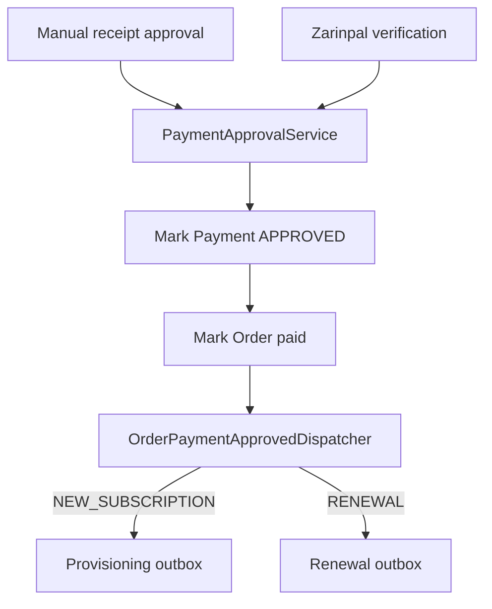

# Payment Lifecycle

Payment approval converges in `PaymentApprovalService`.

Provider callbacks are verified by provider-specific code before approval. The approval service does not trust callback-carried amount, plan, subscription, or renewal data.
