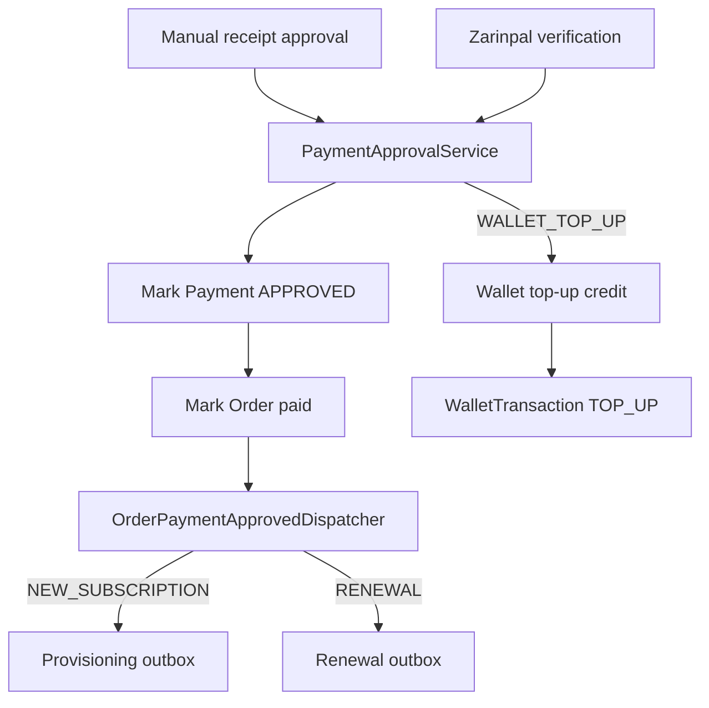

# Payment Lifecycle

Payment approval converges in `PaymentApprovalService`.

Provider callbacks are verified by provider-specific code before approval. The approval service does not trust callback-carried amount, plan, subscription, or renewal data.

Task 49 extends `Payment` with a typed target:

- `ORDER` payments keep the existing `order_id` path.
- `WALLET_TOP_UP` payments reference `wallet_top_up_request_id` and never create an `Order`.

Wallet top-up approval credits the wallet through the wallet ledger use case with an idempotency key derived from the top-up request.
