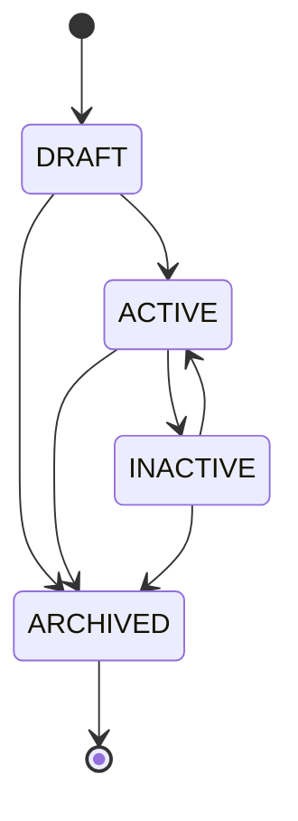

# Plan Domain Model

## Purpose

`Plan` represents a purchasable VPN product option. It defines the commercial and technical limits needed before later tasks add listing, selection, ordering, payment, subscriptions, Telegram handlers, panel integration, or VPN account creation.

The model is intentionally small. It has no relationships to users, orders, payments, subscriptions, Telegram concepts, or 3x-ui entities.

## Fields

| Field | Meaning |
| --- | --- |
| `id` | UUID primary key inherited from `BaseEntity`. |
| `code` | Stable business identifier for lookup and future integrations. |
| `name` | Required display name. |
| `description` | Optional internal/display description. Blank input is stored as `null`. |
| `status` | Lifecycle and availability source of truth. |
| `type` | Traffic behavior: limited or unlimited. |
| `priceAmount` | Whole currency amount stored as an integer. |
| `currency` | ISO-like project currency enum. Initial value is `IRT`. |
| `durationDays` | Positive plan duration in days. |
| `trafficLimitBytes` | Optional positive byte limit for traffic-limited plans. |
| `maxDevices` | Optional positive application-level device limit. |
| `displayOrder` | Non-negative ordering hint for future listing. |
| `createdAt` | Audit timestamp inherited from `BaseEntity`. |
| `updatedAt` | Audit timestamp inherited from `BaseEntity`. |

## Plan Code Rules

`code` is required, unique, normalized, and immutable after insert. It is not derived from the UUID and is not generated automatically.

Rules:

- Trimmed.
- Uppercase.
- Length between 3 and 64 characters.
- No spaces.
- Allowed characters: `A-Z`, `0-9`, `_`, `-`.

Examples:

- `MONTHLY_30GB`
- `MONTHLY_UNLIMITED`
- `THREE_MONTH_100GB`

## Status Lifecycle

`PlanStatus` values:

- `DRAFT`: incomplete or not yet published.
- `ACTIVE`: available for users.
- `INACTIVE`: temporarily unavailable.
- `ARCHIVED`: permanently retired, retained in the database.

`status` is the source of truth for availability. There is no separate active boolean.

Invalid same-state transitions are rejected. Archived plans cannot change state or details. Task 17 admin update use cases map archived detail changes to `409 Conflict` so retired commercial definitions remain stable for future orders, payments, and subscriptions.

## Plan Type Rules

`PlanType.TRAFFIC_LIMITED` requires `trafficLimitBytes` to be present and positive.

`PlanType.UNLIMITED` requires `trafficLimitBytes` to be `null`.

Trial, promotional, lifetime, and enterprise plans are deferred until a confirmed product requirement exists.

## Money And Currency

Money is stored as:

- `long priceAmount`
- `CurrencyCode currency`

`priceAmount` must be zero or positive. Floating-point types are not used for money. Formatting, taxes, discounts, commissions, and payment gateway fees are outside this aggregate.

`CurrencyCode.IRT` means Iranian Toman. When currency is `IRT`, `500000` means 500,000 Toman. No exchange-rate conversion or external currency library is used.

## Traffic Units

Traffic is stored in bytes with `Long trafficLimitBytes`.

The binary convention is used:

`1 GiB = 1024 * 1024 * 1024 bytes`

Example:

`30 GiB = 30L * 1024 * 1024 * 1024`

Display conversion can be added later in application or API layers.

## Maximum Devices

`maxDevices` is optional.

- `null` means no application-level device limit is defined.
- A present value must be positive.

This field does not implement 3x-ui IP-limit behavior. Enforcement is deferred.

## Domain Invariants

The aggregate validates:

- Required and formatted `code`.
- Required, non-blank `name`.
- Maximum lengths for `code`, `name`, and `description`.
- Non-null `type`, `currency`, and internally assigned `status`.
- Non-negative `priceAmount`.
- Positive `durationDays`.
- Type/traffic consistency.
- Positive optional `maxDevices`.
- Non-negative `displayOrder`.

`updateDetails` cannot change `code` or `status` and revalidates all detail invariants. Administrative update flows are expected to call this method only after loading the aggregate by UUID.

## Database Constraints

Flyway migration `V5__create_plans_table.sql` creates the `plans` table with:

- UUID primary key.
- Unique `code`.
- Enum check constraints for `status`, `type`, and `currency`.
- Numeric checks for price, duration, display order, and max devices.
- Traffic consistency check matching the domain rules.
- Indexes on `code`, `status`, `type`, `display_order`, and `created_at`.

Hibernate schema generation remains disabled. Flyway owns the schema and Hibernate validates it.

## Repository Responsibilities

`PlanRepository` is a domain abstraction independent from Spring Data. It supports:

- Saving through inherited UUID repository methods.
- Lookup by normalized `code`.
- Existence checks by normalized `code`.
- Status filtering ordered by display order.
- Listing all plans ordered by display order.

The Spring Data repository and adapter live in infrastructure. Stable ordering uses `displayOrder` and then `code`.

## Deferred Work

Plan has no entity relationships yet because user ownership, order lifecycle, payment state, subscription state, Telegram workflows, and 3x-ui mapping have separate lifecycle and consistency rules.

Discounts are deferred because pricing adjustments need order/payment requirements before they can be modeled correctly.

3x-ui inbound mapping is deferred because panel-specific provisioning details should not leak into the Plan aggregate.

Tasks 17-20 can build on this foundation for application use cases, APIs, ordering, payments, subscriptions, and provisioning.
