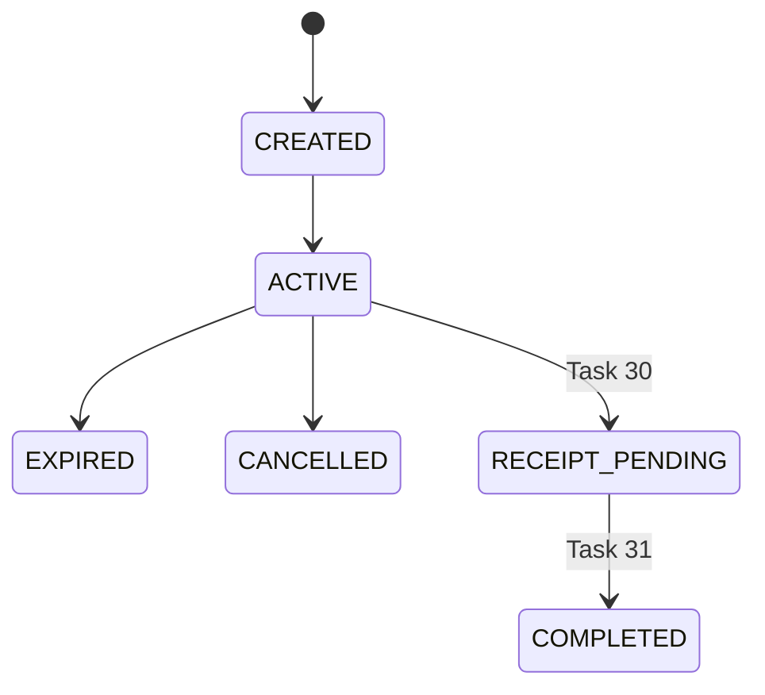
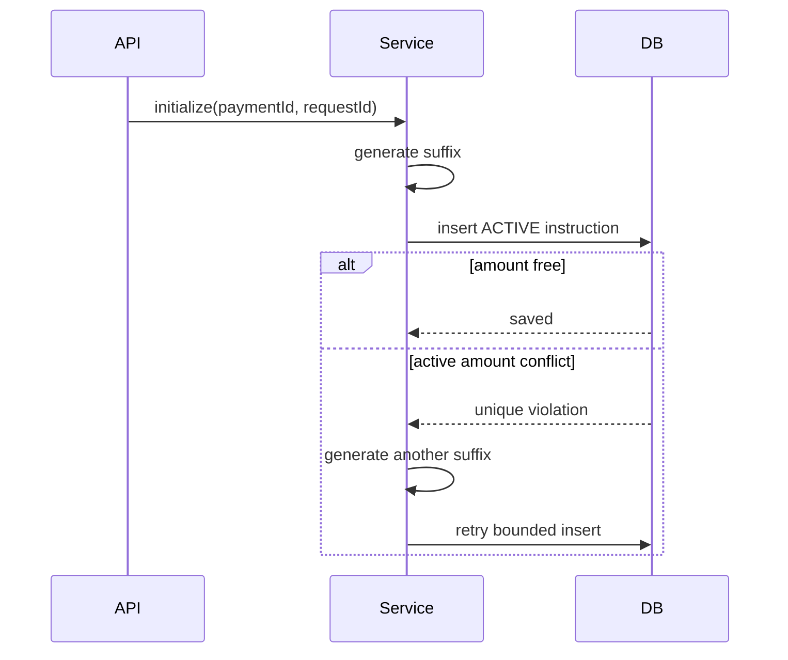
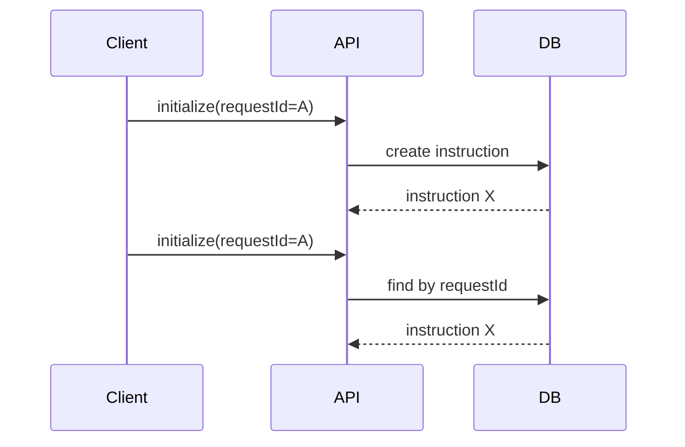
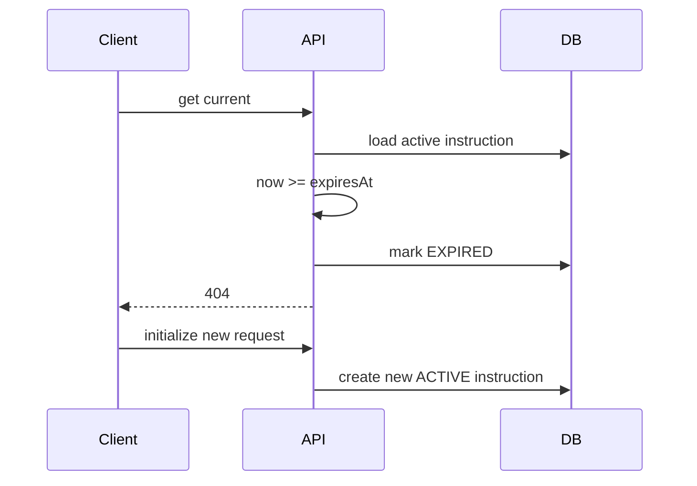
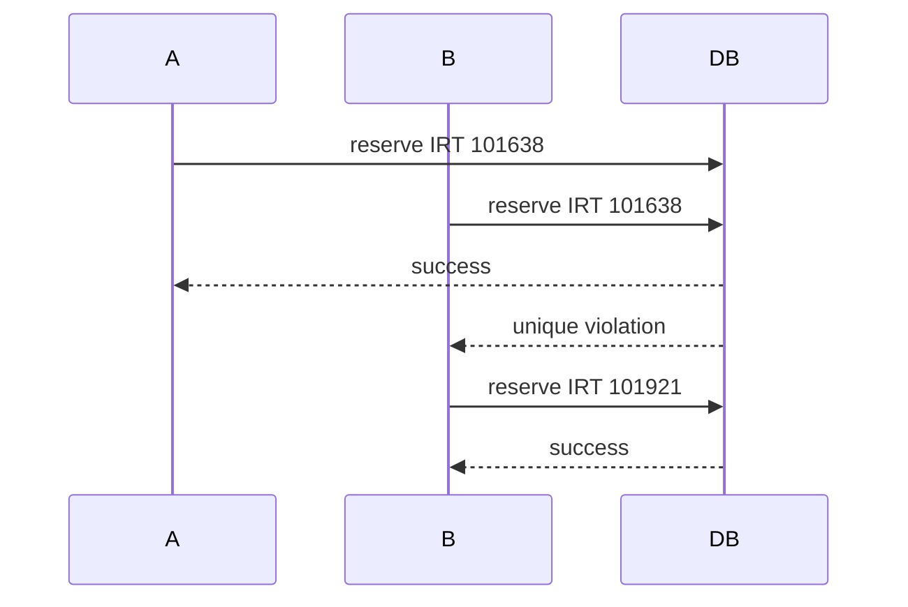

# Manual Card Payment

Task 29 adds manual card-to-card payment instructions. This is not a bank integration and it does not approve a payment.

## Purpose

Manual card payment gives a user a destination card and an exact payable amount. A temporary suffix is added to the original Payment amount so operators can later match transfers more easily.

Example:

- Base amount: `100000 IRT`
- Unique suffix: `1638 IRT`
- Payable amount: `101638 IRT`

The unique amount is only a matching aid. It is not proof of payment.

## Provider Method

The project uses the existing `PaymentMethod.CARD_TO_CARD` enum value. No second `CARD_TO_CARD_MANUAL` value is introduced.

Manual payment requires user transfer, future receipt submission, future operator review, and explicit approval in a later task. Task 29 never marks a Payment as `APPROVED`.

## Instruction Lifecycle

`ManualCardPaymentInstruction` stores instruction history with the Payment ID, request ID, amount snapshot, destination snapshots, masked card number, and lifecycle timestamps.

Task 29 uses `CREATED`, `ACTIVE`, `EXPIRED`, and `CANCELLED`. Receipt and completion states are reserved for later tasks.

## Payment Lifecycle

Creating an active instruction moves the Payment to `WAITING_FOR_PAYMENT`. Instruction expiry or cancellation does not approve, reject, or fail the Payment. The Payment remains reusable until its own expiry and lifecycle rules prevent it.

## Destination Card Security

The active destination is configuration-backed:

- `MANUAL_CARD_DESTINATION_ID`
- `MANUAL_CARD_BANK_NAME`
- `MANUAL_CARD_HOLDER_NAME`
- `MANUAL_CARD_NUMBER`

The full card number is not persisted in the instruction table. Only a masked snapshot such as `6037-****-****-0014` is stored. The full card number can be returned only by the controlled internal instruction endpoint from configuration at response time.

No CVV2, PIN, OTP, internet-bank credential, or receipt data is stored.

## Amount Reservation

The database is the correctness authority. PostgreSQL partial unique indexes enforce one active instruction per Payment and one active `(currency, payable_amount)` reservation.

Active reservation statuses are `CREATED`, `ACTIVE`, and `RECEIPT_PENDING`. Expired and cancelled instructions retain history but release the active reservation.

## Idempotency

`instructionRequestId` is globally unique. Same request ID and same Payment returns the same instruction. Same request ID and another Payment returns conflict. A new request ID while a valid active instruction exists returns the existing instruction.

## Expiration And Reissue

Instruction TTL is configured by `MANUAL_CARD_PAYMENT_TTL`. Expiration is lazy in Task 29 during initialize, get current instruction, or cancel. Expired instructions are marked `EXPIRED` and remain in history. A new instruction may be issued when reissue is enabled and cooldown has passed.

## Concurrency

Concurrent requests are protected by database partial unique indexes, not JVM locks.

## Internal API

- `POST /internal/payments/{paymentId}/manual-card/initialize`
- `GET /internal/payments/{paymentId}/manual-card?telegramUserId=...`
- `POST /internal/payments/{paymentId}/manual-card/cancel`

The response includes display information, exact amounts, masked card number, and controlled full card number. Error responses must not contain the card number.

## Deferred Work

Task 29 does not implement receipt upload, OCR, operator approval or rejection, automatic bank verification, Payment approval, VPN provisioning, Telegram handlers, or reminders.
