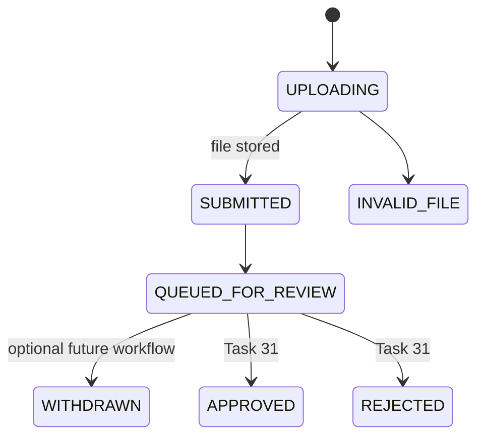
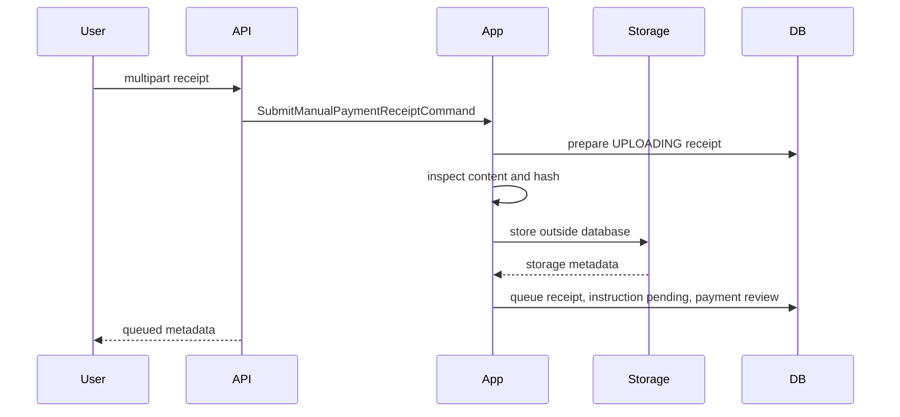
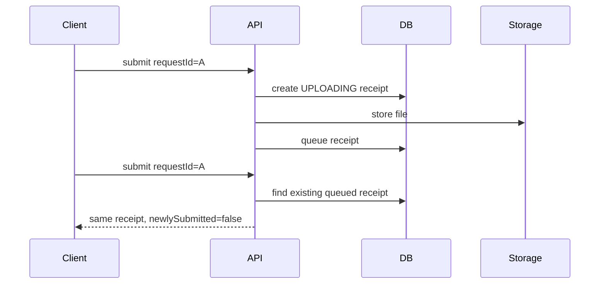
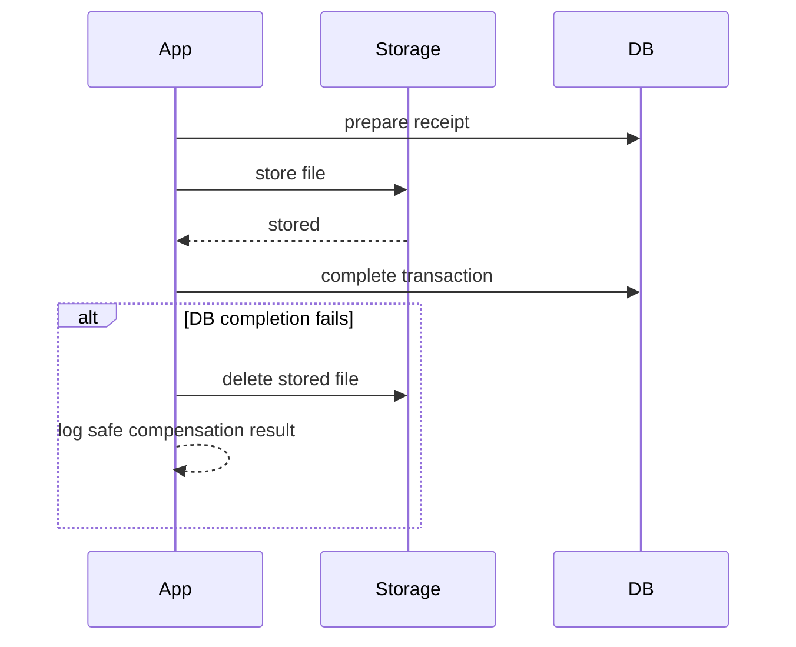
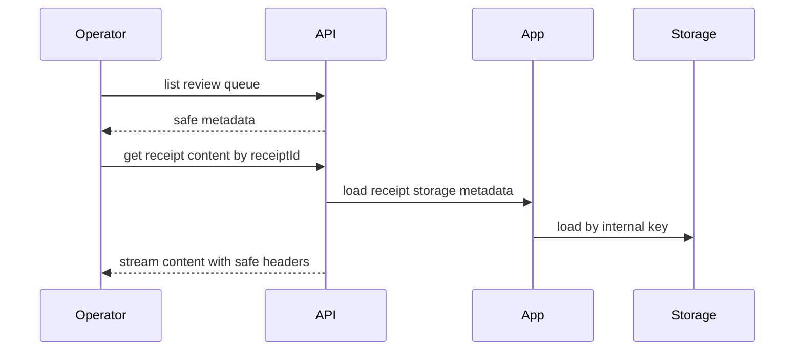

# Manual Payment Receipt Upload

Task 30 adds receipt submission and the internal review queue for manual card-to-card payments. Uploading a receipt is evidence collection only. It does not approve the Payment, reject the Payment, provision a VPN client, or trigger subscription generation.

## Receipt Lifecycle

`ManualPaymentReceipt` stores metadata and storage references only. The receipt file bytes are stored outside PostgreSQL through `PaymentReceiptStorage`.



Task 30 uses `UPLOADING`, `SUBMITTED`, `QUEUED_FOR_REVIEW`, and `INVALID_FILE`.

## Payment And Instruction Transitions

Successful upload performs one short completion transaction:

- Receipt: `UPLOADING -> SUBMITTED -> QUEUED_FOR_REVIEW`
- Instruction: `ACTIVE -> RECEIPT_PENDING`
- Payment: `WAITING_FOR_PAYMENT -> RECEIPT_SUBMITTED -> WAITING_FOR_REVIEW`

The manual instruction keeps its unique amount reservation while a receipt is queued. Reissue is blocked during review.



## File Validation

The application does not trust the original filename or browser MIME type. `PaymentReceiptFileInspector` verifies:

- non-empty size and configured maximum size;
- JPEG, PNG, or PDF magic bytes;
- declared content type consistency when present;
- filename extension consistency;
- image dimensions for supported images;
- SHA-256 hash.

SVG, HTML, executable signatures, unknown files, empty files, oversized files, malformed images, and mismatched extensions are rejected. PDF support is configurable.

## Filename And Path Security

`PaymentReceiptFilenameSanitizer` strips directory components, normalizes Unicode, replaces unsafe characters, bounds length, and uses the detected extension. The sanitized filename is display metadata only.

`LocalPaymentReceiptStorage` generates the storage key internally:

```text
manual-receipts/YYYY/MM/<receipt-id>/<random-file-name>
```

The original filename is never used as a filesystem path. Storage keys are resolved under the configured root and rejected if they are absolute, contain traversal, or escape the root.

## Storage

Configuration prefix:

```text
app.payment.receipt-storage
```

Important environment variables:

- `PAYMENT_RECEIPT_STORAGE_ENABLED`
- `PAYMENT_RECEIPT_STORAGE_PROVIDER`
- `PAYMENT_RECEIPT_LOCAL_ROOT`
- `PAYMENT_RECEIPT_MAX_FILE_SIZE_BYTES`
- `PAYMENT_RECEIPT_ALLOW_PDF`

The local root must be outside `src`, `build`, and `target`. Files are not stored in PostgreSQL and storage paths are never returned by normal APIs.

## Duplicate Detection

The receipt SHA-256 is stored for integrity and duplicate detection.

- Same user + same active file hash: rejected as duplicate.
- Different user + same active file hash: accepted but marked `duplicateHashDetected=true` for operator review.

No automatic fraud decision is made.

## Idempotency

`receiptRequestId` is globally unique.



Reusing the same request ID with different payment or metadata returns conflict.

## Compensation

File storage and database writes are not atomic together. The workflow is split:

1. Prepare receipt row in a short transaction.
2. Inspect and store file outside a database transaction.
3. Complete receipt/payment/instruction transitions in a short transaction.

If storage or inspection fails, the receipt is marked `INVALID_FILE` where possible. If completion fails after storage succeeds, the service attempts best-effort storage deletion and logs only safe metadata.



## Review Queue

The internal review queue returns `QUEUED_FOR_REVIEW` receipts ordered by `reviewQueuedAt` ascending. It includes safe metadata only: receipt IDs, payment IDs, expected and claimed amounts, content type, size, claimed tracking data, duplicate flag, and statuses.

Content is retrieved separately by receipt ID. Operators never provide storage keys.



## Content Streaming Security

The content endpoint sets:

- `Content-Type` from stored detected type;
- safe inline `Content-Disposition`;
- `X-Content-Type-Options: nosniff`;
- `Cache-Control: private, no-store`.

Responses never include filesystem paths or storage keys.

## Multipart Limits

Spring multipart limits are configured and should be matched by reverse proxies in deployment. Oversized uploads return a safe `413` response.

## Deferred Work

Task 30 does not implement operator approval or rejection, receipt OCR, antivirus cloud integrations, bank transaction lookup, Telegram handlers, Payment approval, VPN provisioning, subscription generation, refunds, or settlement reports.
