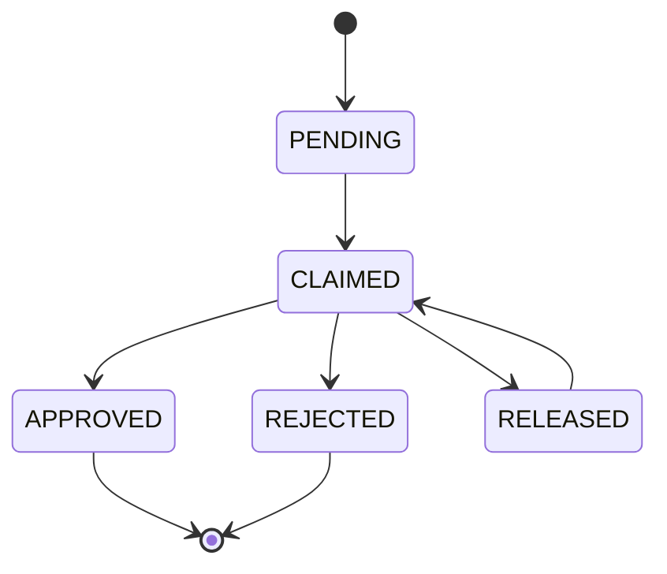
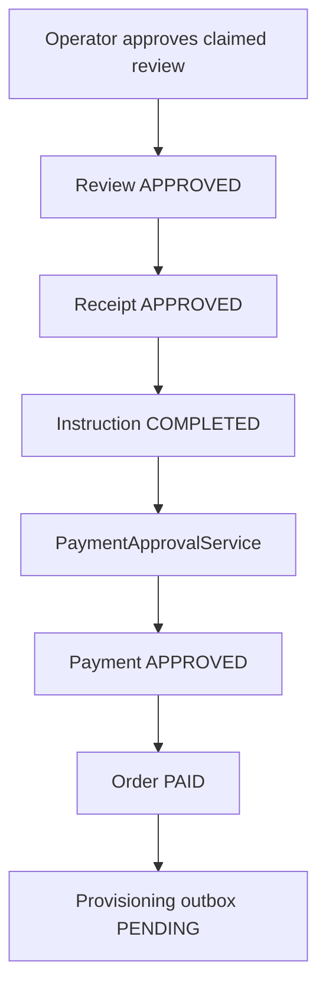
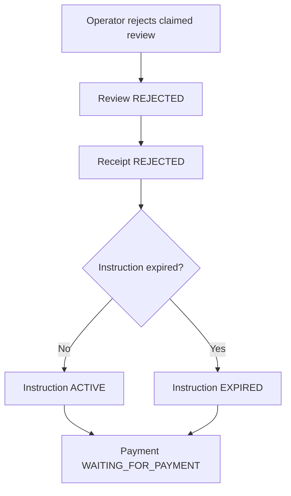

# Manual Payment Review

Task 31 adds the operator workflow that decides manual card-to-card receipts.
Receipt upload is still not proof of payment. A manual payment is approved only
after an operator claims and approves the queued receipt.

## Review Lifecycle

`ManualPaymentReview` is an audit aggregate linked by scalar IDs to:

- receipt
- payment
- order

Review states:

- `PENDING`
- `CLAIMED`
- `APPROVED`
- `REJECTED`
- `RELEASED`

Only the claiming operator may approve, reject, or release a claim. Claims have
a configurable TTL. An expired claim may be taken over by a later operator.

## Operator Identity

The temporary internal API resolves operator identity from `X-OPERATOR-ID`
through `CurrentOperatorProvider`.

This is intentionally isolated behind a port. Production access control must
replace this with Spring Security or an equivalent authenticated operator
identity provider before exposing the endpoints outside a trusted internal
network.

## Approval

Approval requires:

- receipt status `QUEUED_FOR_REVIEW`
- payment status `WAITING_FOR_REVIEW`
- payment method `CARD_TO_CARD`
- instruction status `RECEIPT_PENDING`
- claimed amount equal to the persisted instruction payable amount
- current operator owns the non-expired review claim

Approval transitions in one database transaction:

The review transaction does not call 3x-ui. Provisioning is triggered only by
the durable outbox after the approval transaction commits.

## Rejection

Rejection requires a `ManualPaymentRejectionReason`.

The retry-friendly policy is:

- review becomes `REJECTED`
- receipt becomes `REJECTED`
- payment returns to `WAITING_FOR_PAYMENT`
- instruction returns to `ACTIVE` if still unexpired, otherwise `EXPIRED`
- no provisioning outbox is created

Rejected receipts and files remain immutable audit history. A later task may add
more operator notes or bank references, but Task 31 does not mutate receipt
content.

## Internal API

Base path:

`/internal/admin/manual-payments/reviews`

Endpoints:

- `POST /{receiptId}/claim`
- `POST /{receiptId}/release`
- `POST /{receiptId}/approve`
- `POST /{receiptId}/reject`
- `GET /{receiptId}`
- `GET /`

Responses expose IDs, review state, receipt/payment/order/instruction statuses,
amount match, duplicate-hash flag, reviewer ID, and safe notes. They do not
expose receipt file bytes, storage keys, full card numbers, or payment provider
secrets.

## Concurrency

The database enforces one review per receipt. Application services validate the
current review, receipt, payment, and instruction state in short transactions.
The existing partial unique index on approved payments keeps one approved
payment per order as the final guard.
