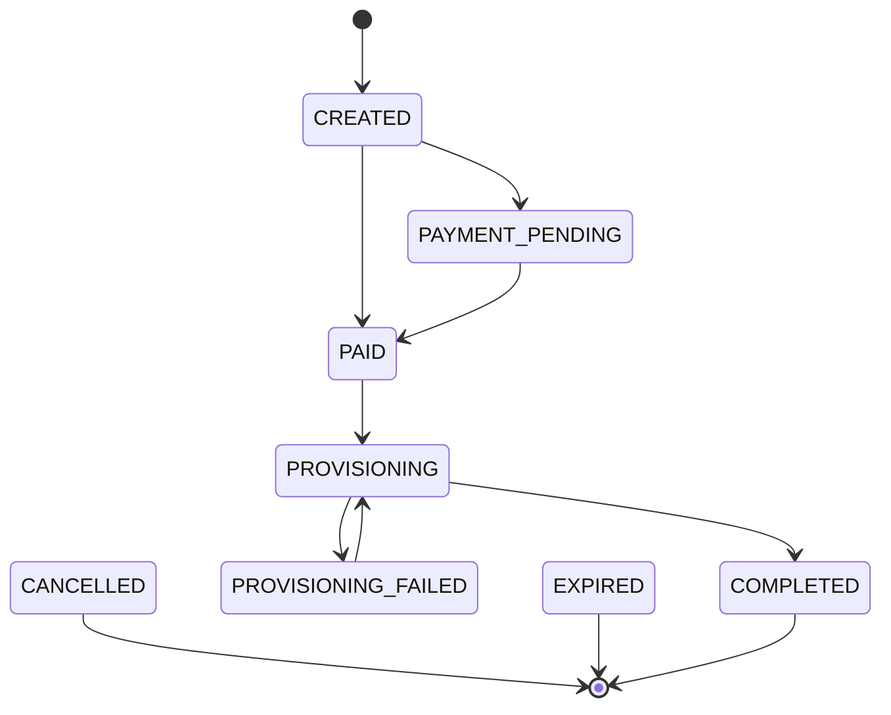
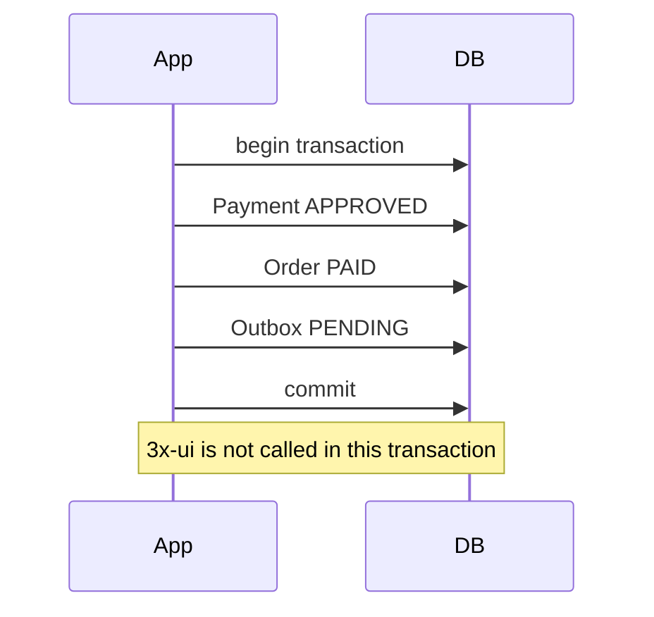

# Payment Approval

Task 31 centralizes final payment approval in `PaymentApprovalService`.

Both verified Zarinpal callbacks and approved manual receipt reviews converge on
this service. No controller and no provider-specific verification service owns
final approval rules.

## Approval Rules

The service:

- loads the persisted payment and order
- verifies payment and order ownership match
- rejects approval when another payment for the order is already approved
- marks the payment `APPROVED`
- marks the order `PAID`
- creates a provisioning outbox record when the order requires provisioning

The database partial unique index on `payments(order_id) WHERE status =
'APPROVED'` remains the final correctness guard.

## Order Lifecycle

Task 31 expands orders for paid and provisioned states:

Payment approval marks the order `PAID`. It does not mark the order
`COMPLETED`; completion is reserved for successful VPN provisioning.

## Zarinpal Convergence

Zarinpal verification still performs server-to-server verification first.
After a successful or already-verified response, the Zarinpal attempt is marked
verified and `PaymentApprovalService` finalizes the local payment and order in
the same local transaction.

Duplicate callbacks remain idempotent because an already approved payment with
the same reference returns a stable approval result and does not create another
outbox row.

## Manual Convergence

Manual approval starts from an operator-approved receipt review. The manual
review service marks review, receipt, and instruction terminal locally, then
delegates the final payment/order/outbox transition to `PaymentApprovalService`
inside the same transaction.

## Atomicity

If the transaction rolls back, payment approval, order payment, and the outbox
record all roll back together.
