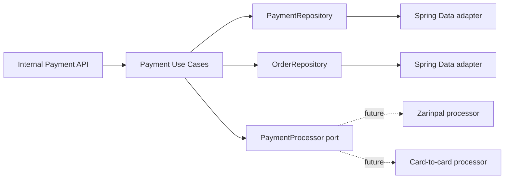
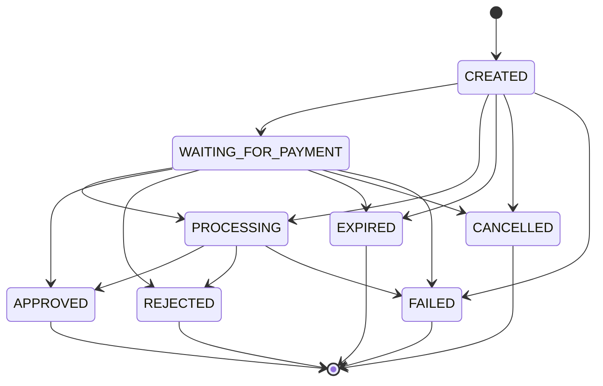

# Payment Foundation

Task 27 introduces the local payment foundation only. It does not implement Zarinpal, manual receipt upload, callbacks, verification endpoints, operator approval, subscriptions, Telegram handlers, or VPN provisioning.

## Architecture

Payments are modeled as a domain aggregate and accessed through application ports. Controllers depend on input ports, application services depend on domain repositories and payment processor ports, and Spring Data remains in infrastructure adapters.

## Strategy Pattern

`PaymentProcessor` defines the future provider boundary:

- `supportedMethod()`
- `initiate(PaymentInitializationCommand)`
- `verify(PaymentVerificationCommand)`

`PaymentService` receives all processors from Spring and builds a method-to-processor map. Business logic does not switch on `PaymentMethod`; adding a provider later means adding a new processor bean.

Task 28 adds the Zarinpal processor and provider-specific attempt model without changing the generic payment aggregate.

## State Machine

Payments start as `CREATED`.

There is no generic status setter. Domain methods enforce transitions.

## Persistence

Migration `V10__create_orders_and_payments.sql` creates:

- `orders`, a minimal local aggregate used only as the payment parent.
- `payments`, with method/status stored as strings.
- `payment_operations`, an append-only operation history table.

The database enforces:

- `payable_amount >= base_amount`
- valid method and status values
- foreign keys to `orders` and `users`
- one approved payment per order through a partial unique index

## Internal API

Temporary internal endpoints:

- `POST /internal/payments`
- `GET /internal/payments/{id}`
- `GET /internal/orders/{id}/payments`

These endpoints create and read local payment records only. They do not initiate a gateway payment, verify a payment, approve a manual payment, upload receipts, or provision VPN clients.

## Payment Operation History

`PaymentOperation` records local payment events such as creation and future initialization/verification attempts. Messages are bounded and sanitized. Raw gateway responses are not stored.

## Future Providers

Future Zarinpal and card-to-card support should add provider-specific classes that implement `PaymentProcessor`. The application service can select the implementation automatically using `supportedMethod()`.

Task 28 may add gateway-specific initialization, but it should not change the payment aggregate invariants introduced here.
