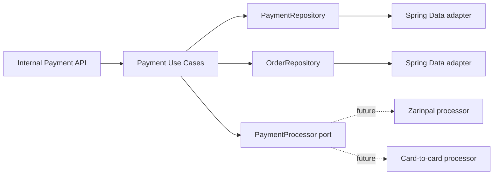
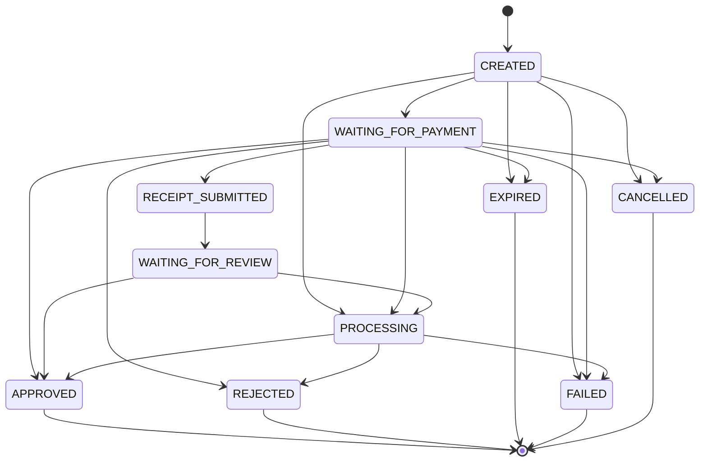

# Payment Foundation

Task 27 introduced the local payment foundation only. Task 28 added Zarinpal request/callback/verification. Task 29 added manual card-to-card payment instructions with unique payable amounts. Task 30 added manual receipt upload and the review queue. Task 31 adds manual receipt review, shared payment approval, order paid/finalized states, and a provisioning outbox. Telegram handlers, subscription links, QR codes, refunds, OCR, and full admin UI remain deferred.

## Architecture

Payments are modeled as a domain aggregate and accessed through application ports. Controllers depend on input ports, application services depend on domain repositories and payment processor ports, and Spring Data remains in infrastructure adapters.

## Strategy Pattern

`PaymentProcessor` defines the future provider boundary:

- `supportedMethod()`
- `initiate(PaymentInitializationCommand)`
- `verify(PaymentVerificationCommand)`

`PaymentService` receives all processors from Spring and builds a method-to-processor map. Business logic does not switch on `PaymentMethod`; adding a provider later means adding a new processor bean.

Task 28 adds the Zarinpal processor and provider-specific attempt model without changing the generic payment aggregate.

Task 29 adds the manual card processor and provider-specific instruction model. Task 30 adds receipt metadata, storage ports, and review queue use cases. Task 31 adds operator review use cases and shared approval through `PaymentApprovalService`. Manual card payment uses dedicated instruction, receipt, and review use cases because it does not have meaningful online gateway verification.

## State Machine

Payments start as `CREATED`.

There is no generic status setter. Domain methods enforce transitions.

## Persistence

Migration `V10__create_orders_and_payments.sql` creates:

- `orders`, a minimal local aggregate used only as the payment parent.
- `payments`, with method/status stored as strings.
- `payment_operations`, an append-only operation history table.

The database enforces:

- `payable_amount >= base_amount`
- valid method and status values
- foreign keys to `orders` and `users`
- one approved payment per order through a partial unique index

## Internal API

Temporary internal endpoints:

- `POST /internal/payments`
- `GET /internal/payments/{id}`
- `GET /internal/orders/{id}/payments`

These endpoints create and read local payment records only. Provider-specific endpoints initialize Zarinpal, create manual-card instructions, accept manual receipt uploads, and expose internal operator review actions. Task 31 approval creates a durable provisioning outbox record; 3x-ui provisioning is performed later by the outbox worker.

## Payment Operation History

`PaymentOperation` records local payment events such as creation and future initialization/verification attempts. Messages are bounded and sanitized. Raw gateway responses are not stored.

## Future Providers

Provider-specific classes implement `PaymentProcessor` for registration, while dedicated use cases handle provider-specific flows such as Zarinpal callbacks or manual-card instructions. The application service can select processors automatically using `supportedMethod()`.
