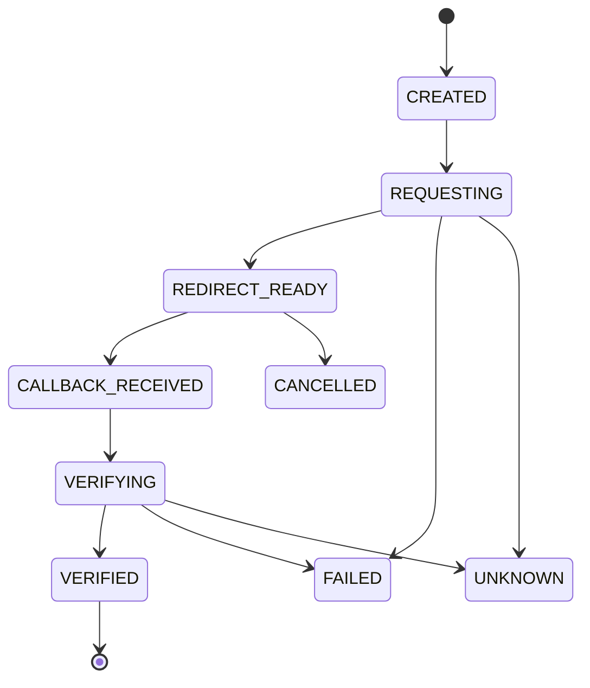
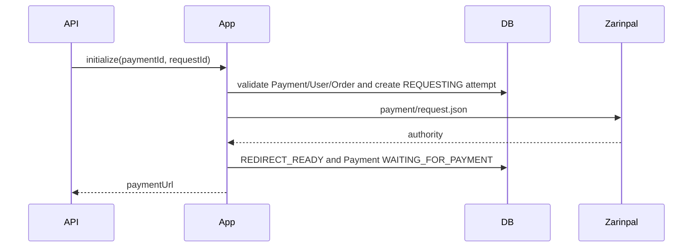
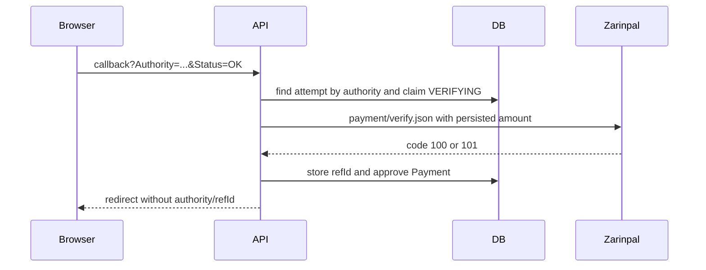

# Zarinpal Payment Flow

Task 28 implements Zarinpal online payment initialization, browser callback handling, and server-to-server verification. It does not implement manual card-to-card payment, receipt upload, operator approval, provisioning, subscriptions, Telegram handlers, refunds, settlement reports, or reconciliation jobs.

## Official Contract

Verified on 2026-07-12 from official Zarinpal documentation:

- Request endpoint concept: `POST /pg/v4/payment/request.json`
- Verify endpoint concept: `POST /pg/v4/payment/verify.json`
- StartPay redirect concept: `/pg/StartPay/{authority}`
- Callback query parameters: `Authority` and `Status`
- Successful callback status: `OK`
- Cancelled/failed callback status: `NOK`
- Verify success code: `100`
- Already verified code: `101`

The official docs currently show host-name drift between `payment.zarinpal.com` and `api.zarinpal.com`, so host and path values are fully configurable. The default follows the Task 28 contract: `https://api.zarinpal.com`.

## Configuration

Properties live under `app.payment.zarinpal`.

Important environment variables:

- `ZARINPAL_ENABLED`
- `ZARINPAL_MERCHANT_ID`
- `ZARINPAL_API_BASE_URL`
- `ZARINPAL_STARTPAY_BASE_URL`
- `ZARINPAL_REQUEST_PATH`
- `ZARINPAL_VERIFY_PATH`
- `ZARINPAL_CALLBACK_BASE_URL`
- `ZARINPAL_SUCCESS_REDIRECT_URL`
- `ZARINPAL_FAILURE_REDIRECT_URL`
- `ZARINPAL_CANCEL_REDIRECT_URL`

No real merchant ID is committed. The merchant ID is never returned by API DTOs.

## Currency

The project stores money as whole IRT. Current Zarinpal request supports a `currency` field, so the implementation sends `currency=IRT` and preserves the local payable amount exactly as the gateway amount. The gateway amount is persisted on the attempt and reused for Verify.

## Lifecycle

Payment approval only happens after a successful server-to-server Verify response.

## Initialization

Initialization is idempotent by `requestId`. A request timeout marks the attempt `UNKNOWN` and does not approve the Payment.

## Callback And Verify

Callback parameters are not trusted for amount, user, order, or approval. `Status=OK` only triggers Verify. `Status=NOK` cancels a still-payable payment and does not call Verify.

## Duplicate Callback

Repeated callbacks for a verified payment return a success redirect without a second Verify call. `APPROVED` is terminal; cancellation never overwrites approval.

## Uncertain Results

Request uncertainty:

- attempt becomes `UNKNOWN`
- Payment is not approved
- no unlimited retry loop is started

Verify uncertainty:

- attempt and Payment become `UNKNOWN`
- no approval is recorded
- a later callback/recovery can verify the same authority and persisted amount

## Internal API

- `POST /internal/payments/{paymentId}/zarinpal/initialize`
- `GET /api/payments/zarinpal/callback`

The callback redirects to configured frontend URLs with only a non-sensitive `result` query parameter.

## Deferred Work

Task 29 may add manual card-to-card payment. Later tasks may add outbox processing, provisioning after approval, Telegram flows, receipts, and reconciliation jobs.
