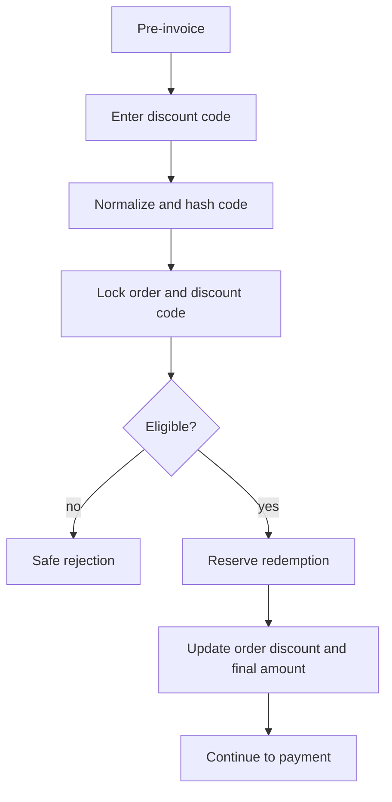

# Discount Codes

Task 51 adds discount codes as trusted server-side order pricing adjustments.

Rules:

- Raw codes are normalized and hashed before lookup.
- `Order.baseAmount` remains the original trusted amount.
- `Order.discountAmount` and `Order.finalAmount` are updated atomically with a `PromotionRedemption`.
- Applying a discount after any payment exists is rejected.
- Payment creation uses `Order.finalAmount`.
- Payment approval consumes the reserved redemption exactly once.
- Zero-final-amount orders are not supported in Task 51.

