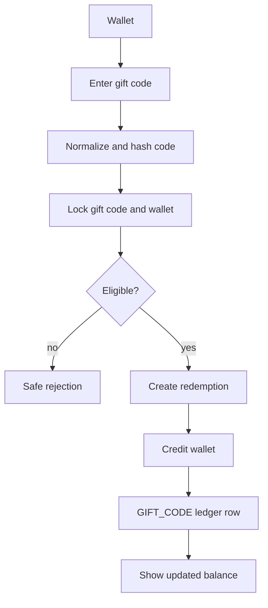

# Gift Codes

Gift codes credit the customer wallet through the immutable wallet ledger.

Rules:

- Gift codes never create orders or payments.
- Wallet credit goes through `CreditWalletUseCase`.
- The ledger transaction type is `GIFT_CODE`.
- The ledger reference type is `GIFT_CODE_REDEMPTION`.
- One redemption produces at most one wallet credit.

