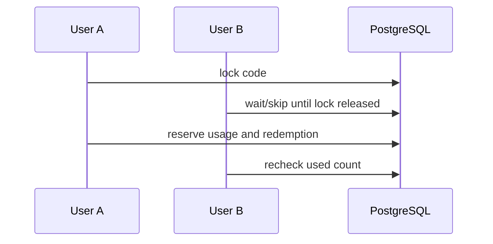

# Promotion Concurrency

Promotion writes rely on database locking and uniqueness.

Concurrency guarantees:

- Usage limits are checked while the code row is locked.
- Order discount changes are made while the order row is locked.
- Wallet credit uses the existing wallet row lock and ledger uniqueness.
- No JVM synchronization is used for financial correctness.

