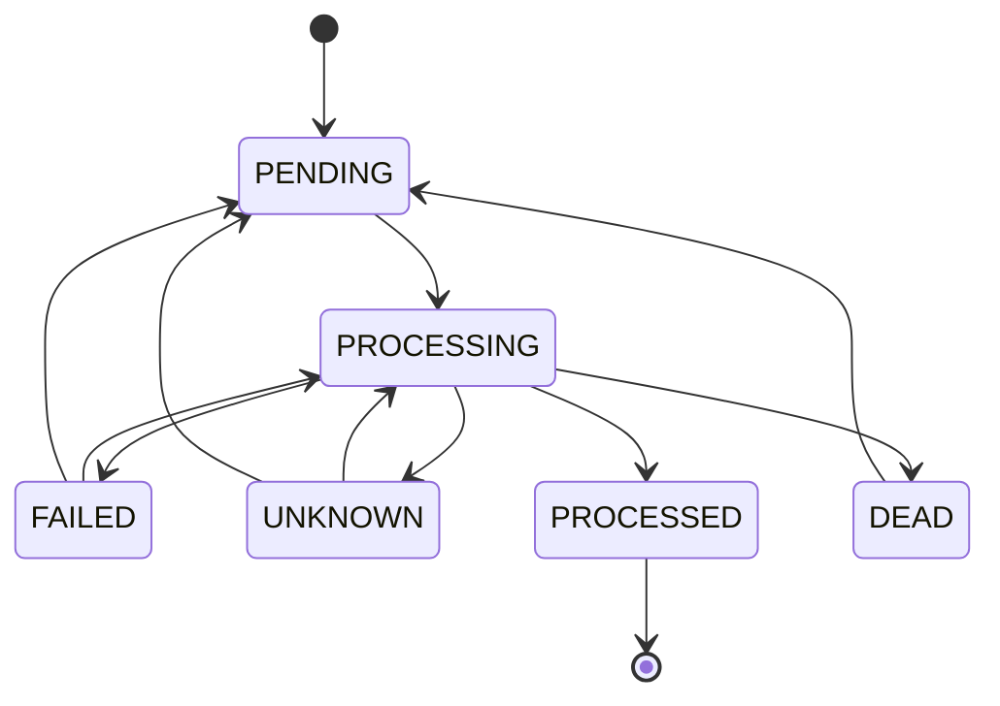
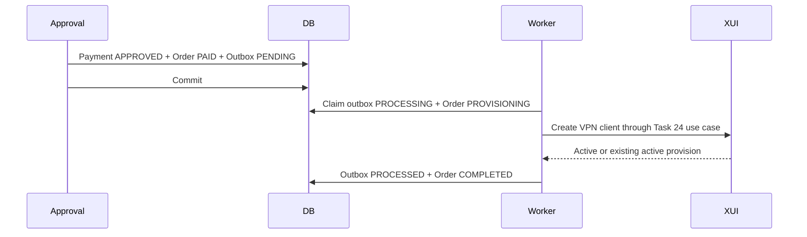
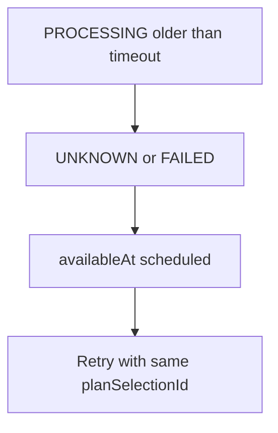

# Payment Provisioning Outbox

Task 31 introduces a transactional outbox for provisioning work caused by paid
orders.

The outbox guarantees that a committed payment approval creates a durable
provisioning command, and that VPN provisioning runs only after the approval
transaction commits.

## Aggregate

`ProvisioningOutbox` stores:

- event ID
- order, payment, user, plan, and plan-selection IDs
- type
- status
- payload version
- JSON payload
- retry timestamps and failure metadata

Task 31 uses type `CREATE_VPN_CLIENT` with payload version
`create-vpn-client.v1`.

The payload contains trusted IDs only:

- order ID
- payment ID
- user ID
- telegram user ID
- plan ID
- plan selection ID
- optional preferred inbound ID

It does not contain credentials, cookies, provider responses, or receipt data.

## State Machine

`PROCESSED` is terminal for normal processing. `DEAD` can be manually retried
through the internal operational endpoint.

## Transaction Flow

No 3x-ui call occurs inside the payment approval transaction.

## Idempotency

There are two layers:

- outbox uniqueness: one event per order and provisioning type
- remote provisioning idempotency: Task 24 uses `planSelectionId`

Repeated outbox execution calls the same `CreateVpnClientUseCase`, which
returns the existing active provision instead of creating another remote client.

## Retry and Dead Letter

Retryable failures schedule exponential backoff using:

- `PROVISIONING_OUTBOX_INITIAL_RETRY_DELAY`
- `PROVISIONING_OUTBOX_MAX_RETRY_DELAY`
- `PROVISIONING_OUTBOX_RETRY_MULTIPLIER`
- `PROVISIONING_OUTBOX_MAX_ATTEMPTS`

Unknown outcomes are preserved as `UNKNOWN` and retried using the same
idempotency key. After max attempts, the outbox becomes `DEAD` and the order
remains `PROVISIONING_FAILED`.

## Stale Processing Recovery

Rows stuck in `PROCESSING` beyond `PROVISIONING_OUTBOX_PROCESSING_TIMEOUT` are
treated as uncertain. The processor schedules them for retry instead of assuming
the remote call failed.

## Operational API

Internal endpoints:

- `GET /internal/admin/provisioning/outbox`
- `GET /internal/admin/provisioning/outbox/{eventId}`
- `POST /internal/admin/provisioning/outbox/{eventId}/retry`

The response summarizes status and failure metadata. It does not expose raw
payload, credentials, cookies, or provider response bodies.
