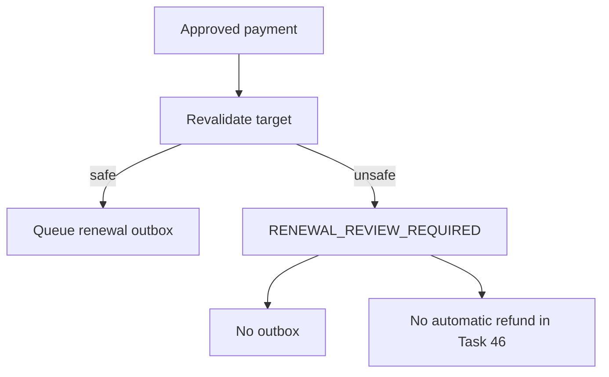

# Renewal Approval Failure Policy

If money is approved but the renewal target becomes unsafe, Task 46 does not queue remote work. The renewal order moves to `RENEWAL_REVIEW_REQUIRED`; payment stays approved for operator investigation.

Examples:

- missing renewal snapshot;
- target subscription missing or no longer owned by the order user;
- revoked or invalid subscription;
- missing or invalid provision;
- missing remote client reference.

