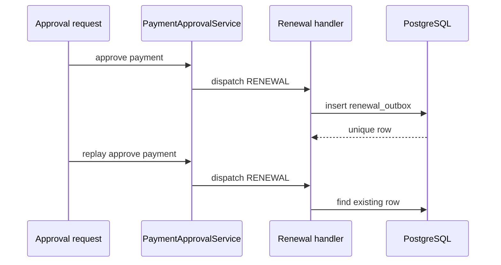

# Renewal Approval Idempotency

Idempotency keys:

- Payment approval: existing provider/manual approval request identity.
- Renewal dispatch: `paymentId + orderId`.
- Renewal outbox: `renewalOrderId + eventType`.
- Customer queued notification: emitted only when the outbox row is newly created.

Correct replay result: payment remains approved, order remains renewal-pending, one renewal outbox exists, and no new-subscription provisioning outbox is created.
