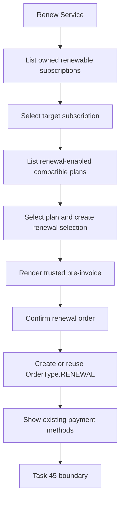
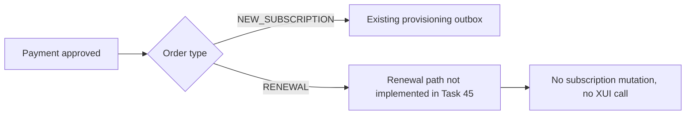

# Renewal Domain

Task 45 models renewal as an `OrderType.RENEWAL` order that targets an existing `Subscription`. It reuses the existing PlanSelection, Telegram purchase session, Order, and Payment handoff instead of creating a parallel renewal payment system.

Renewal stops at payment-method selection. Payment approval, subscription mutation, renewal outbox, and remote 3x-ui changes are Task 46+ concerns.

New purchase and renewal share infrastructure but are separated by explicit type fields:

- `Order.type`: `NEW_SUBSCRIPTION` or `RENEWAL`
- `PlanSelection.selectionType`: `NEW_SUBSCRIPTION` or `RENEWAL`
- `TelegramPurchaseSession.flowType`: `NEW_SUBSCRIPTION` or `RENEWAL`

Task 47 applies the paid renewal to the existing XUI client only after a Renewal Outbox row is claimed. It updates local Subscription and provision state after remote success and writes immutable renewal history.
