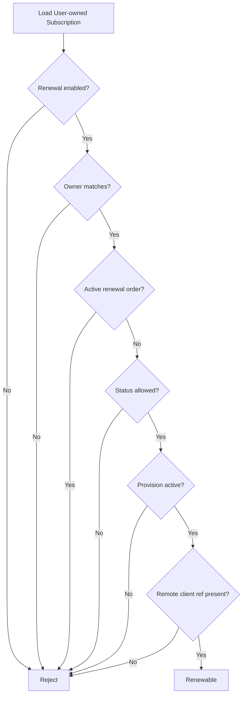

# Renewal Eligibility

`RenewableSubscriptionPolicy` decides whether a customer-owned subscription can enter renewal. It never trusts Telegram callback data for ownership, status, expiry, traffic, or amount.

Eligible by default:

- Active subscription with successful local provision.
- Expired subscription with successful local provision and remote client reference.

Rejected by default:

- Renewal sales disabled.
- Ownership mismatch.
- Provisioning, failed, revoked, invalid, suspended, or missing provision state.
- Missing remote client reference.
- Existing active renewal order unless the caller is explicitly reusing it.

Messages use localization keys. Internal enum names are not displayed to customers.
