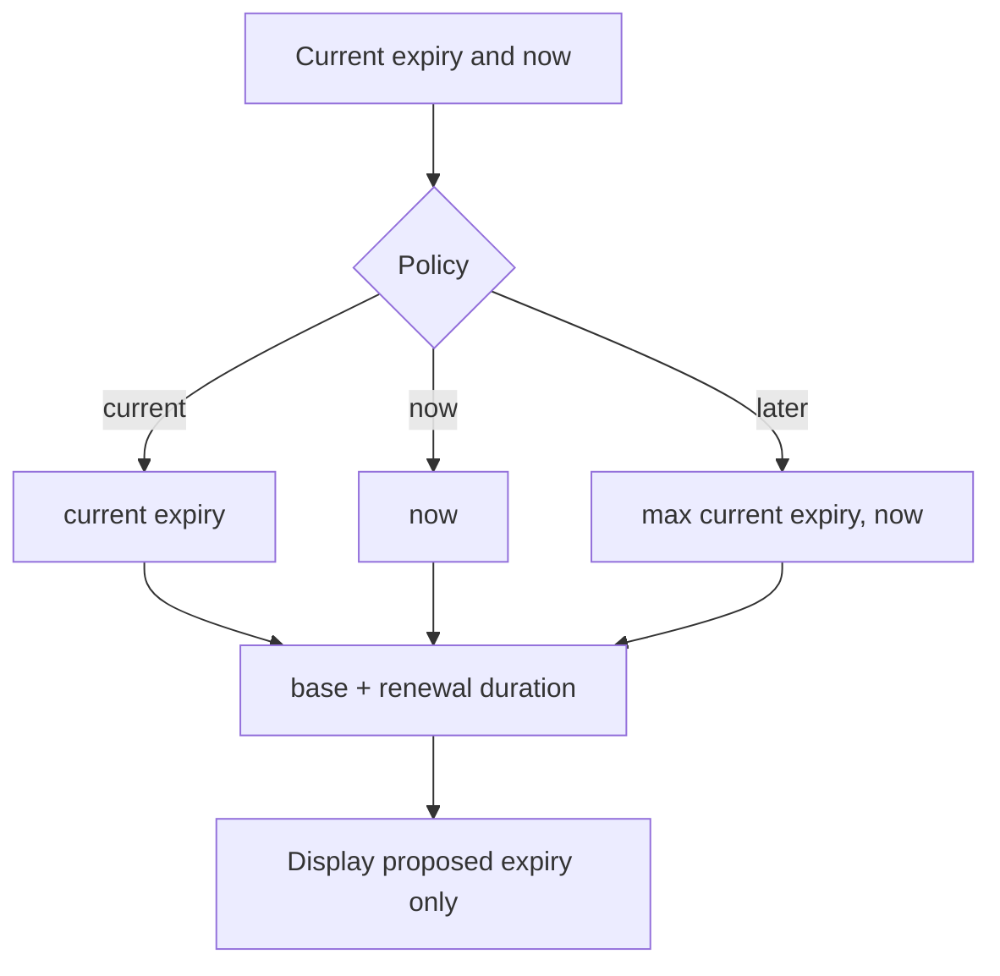

# Renewal Expiry Policy

`RenewalExpiryCalculator` calculates a proposed expiry for display and snapshot context only. Task 45 never writes the proposed expiry to `subscriptions` or 3x-ui.

Policies:

- `EXTEND_FROM_CURRENT_EXPIRY`: `currentExpiry + duration`
- `EXTEND_FROM_NOW`: `now + duration`
- `EXTEND_FROM_LATER_OF_NOW_OR_EXPIRY`: `max(now, currentExpiry) + duration`

Default:

```text
EXTEND_FROM_LATER_OF_NOW_OR_EXPIRY
```

This extends active subscriptions from their current expiry and expired subscriptions from current time.


