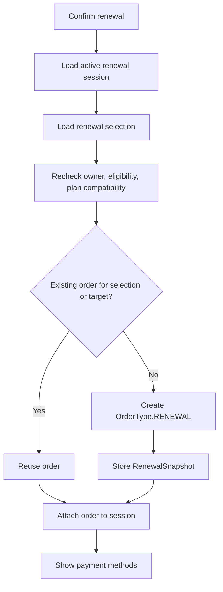

# Renewal Order

Task 45 extends the existing Order aggregate. `OrderType.RENEWAL` is used for renewal orders and references the target subscription through `target_subscription_id`.

Invariants:

- Renewal order must have `targetSubscriptionId`.
- Renewal order must have `renewalSnapshot`.
- Snapshot target subscription, source plan, amount, and currency must match the order.
- Renewal order does not require new-subscription provisioning.
- Renewal order cannot create a new subscription, XUI client, or outbox in Task 45.

Duplicate confirmation is protected by repository lookup and database uniqueness for active renewal orders per target subscription.
