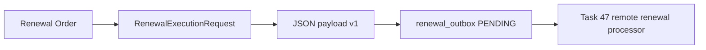

# Renewal Outbox

Renewal approval creates a dedicated `renewal_outbox` row with event type:

```text
renewal.apply.requested.v1
```

The row is unique by `(renewal_order_id, event_type)`, so replayed approval requests reuse the same record.



The payload excludes subscription tokens, VLESS URI, XUI credentials, provider callback bodies, card data, and Telegram messages. Task 46 only persists the pending request.

Task 47 adds execution-step tracking and a deterministic target payload to avoid double extension during retries. The outbox remains the single retry authority for remote renewal execution.
