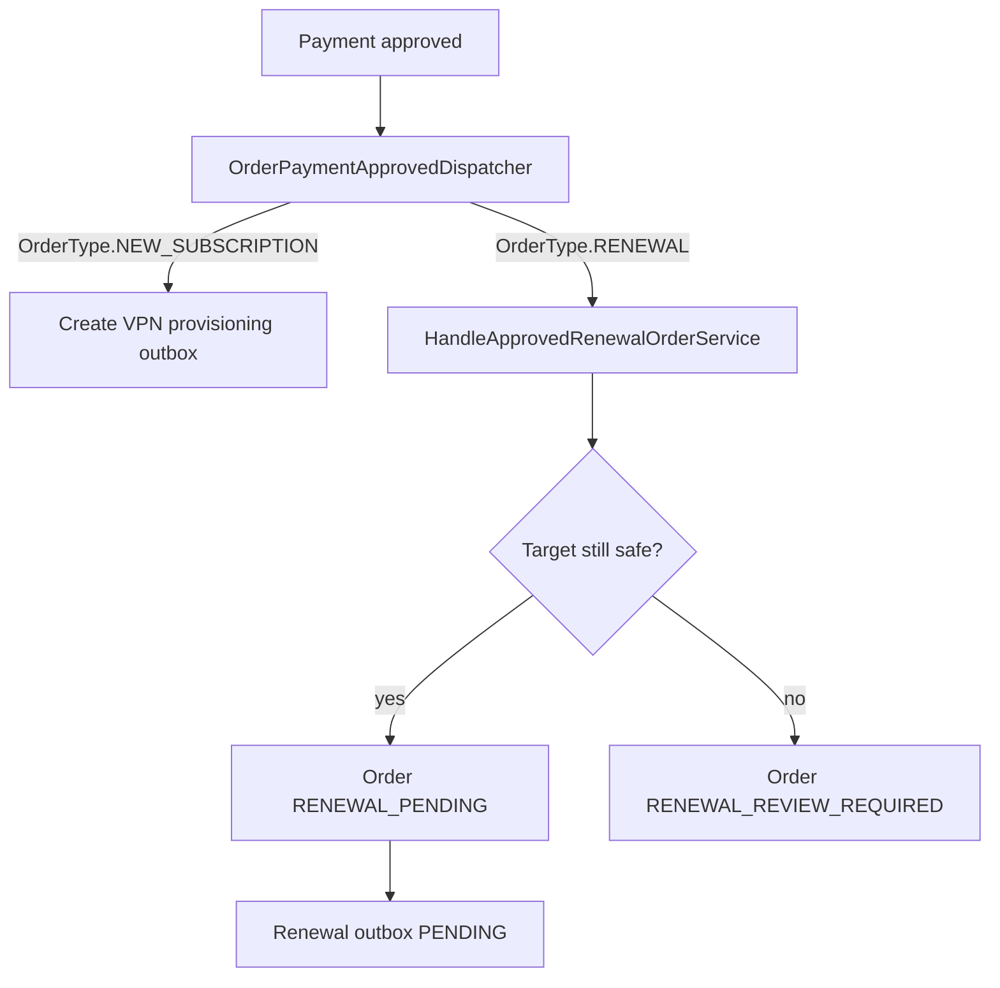

# Renewal Payment Approval

Task 46 routes approved payments through a single application dispatch point.

Manual receipt approval and Zarinpal verification both call `PaymentApprovalService`. Replays also call the dispatcher, so a restart between payment approval and renewal outbox creation can be repaired by repeating the approval path.

Task 46 does not reprice the order and does not use provider callback data for renewal facts. Renewal execution data is built from persisted order, payment, subscription, and provision records.

Boundary: no 3x-ui call, no subscription expiry or traffic mutation, no new subscription or XUI client, and no Task 47 worker.
