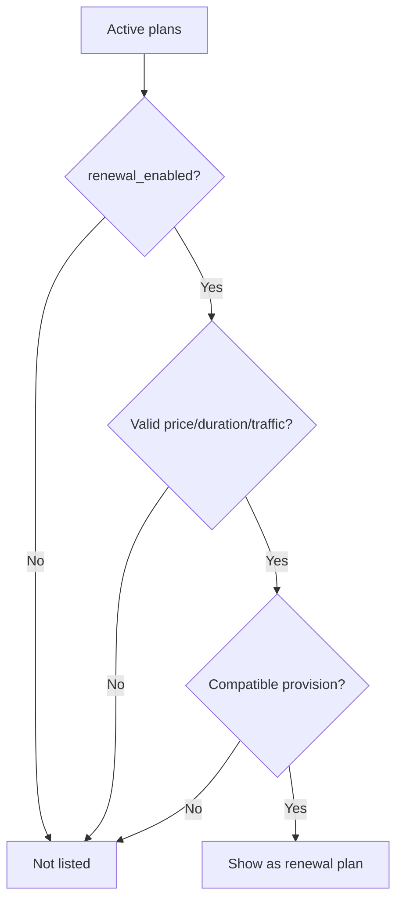

# Renewal Plan Compatibility

Renewal plans must be explicitly enabled. An active Plan is not automatically renewable.

`RenewalPlanEligibilityPolicy` requires:

- Renewal sales capability enabled.
- Plan status `ACTIVE`.
- `renewal_enabled=true`.
- Valid price, duration, traffic, and device limits.

`RenewalPlanCompatibilityPolicy` currently keeps Task 45 conservative:

- Existing subscription and provision must belong to the same user.
- Subscription must reference the same local provision.
- Provision must have a valid inbound and remote client reference.
- No server migration, client recreation, or remote lookup is attempted.

