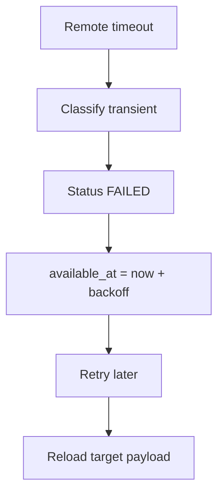

# Renewal Retry And Recovery

The renewal outbox stores `execution_step` and a versioned deterministic target payload. Retries reuse the same absolute expiry and traffic values, so a renewal is not extended twice.

Permanent failures such as missing remote client or identity mismatch move the order to renewal review and do not create a replacement client.
