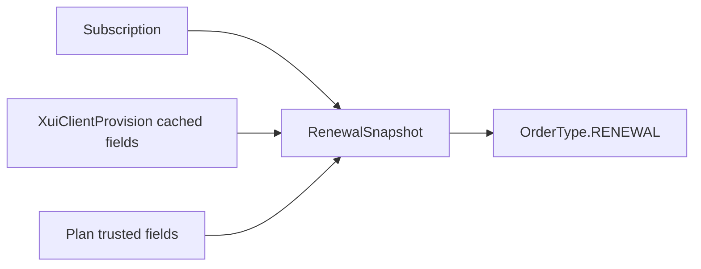

# Renewal Snapshot

`RenewalSnapshot` stores trusted data captured at renewal order creation. It is immutable from the domain point of view and persisted as JSONB on the order.

Included:

- Target subscription and provision IDs.
- Safe service display name and service username.
- Current expiry and cached traffic state.
- Renewal duration, traffic policy, and plan traffic.
- Original and final amount.
- Plan name, description, source plan ID, and capture time.

Excluded:

- Raw subscription token or token hash.
- VLESS URI.
- XUI credentials, private key, inbound credentials, or provider responses.
- Telegram callback payloads.

