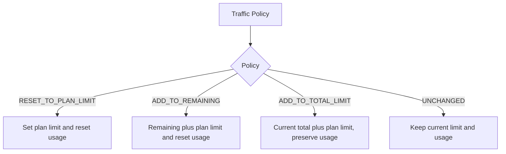

# Renewal Traffic Application

Traffic policies are applied as absolute target values.

The current 3x-ui mapping treats `0` total traffic as unlimited. A renewal plan with no traffic limit is also applied as unlimited.
