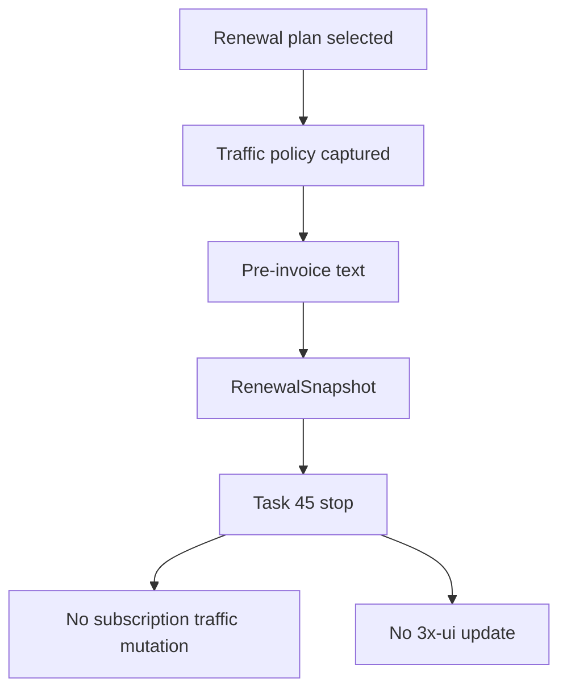

# Renewal Traffic Policy

Task 45 models renewal traffic behavior but does not apply it locally or remotely.

Supported policies:

- `RESET_TO_PLAN_LIMIT`
- `ADD_TO_REMAINING`
- `ADD_TO_TOTAL_LIMIT`
- `UNCHANGED`

Default:

```text
RESET_TO_PLAN_LIMIT
```

The default means the pre-invoice describes the renewal plan traffic as the post-renewal plan limit. Task 46 must decide how to apply that to the remote client and local cached state.


