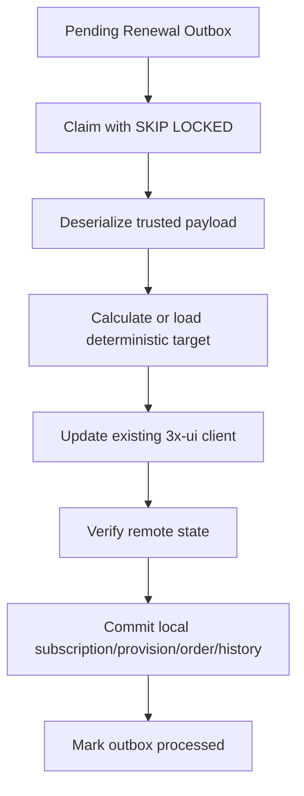

# Renewal Worker

Task 47 processes `renewal_outbox` rows created after approved renewal payments.

The scheduler is controlled by `app.renewal.worker.*`. It claims rows in short transactions and never holds a database lock while calling 3x-ui.
