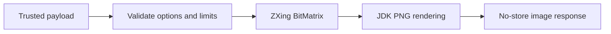

# QR Code Delivery

Task 34 adds local QR generation for two trusted payloads:

- `SUBSCRIPTION_URL`: the configured public `/sub/{token}` URL, available only when the raw token is supplied and verified.
- `VLESS_URI`: one internally rendered VLESS configuration URI selected by one-based config index.

Arbitrary text QR generation is not exposed.

## Rendering

PNG is the only supported output format in Task 34. SVG is modeled but disabled because PNG is lossless, broadly compatible, and avoids XML/script safety concerns for this phase.

ZXing core is used locally to create QR matrices. The application renders PNGs directly with JDK image APIs; payloads are never sent to third-party services.

## Options

Defaults:

- size: 512 x 512 pixels;
- margin: 4 modules;
- error correction: `MEDIUM`;
- format: `PNG`;
- transparent background: disabled.

Accepted size is bounded by configuration, defaulting to 128 through 2048 pixels. Margins default to 4 and are capped at 16 modules. Higher error correction increases QR density and can reduce capacity for long VLESS URIs.

## Limits

Payload length is bounded before QR generation. The default maximum is 4096 characters. Oversized content is rejected; the service never truncates a URL or removes required VLESS parameters.

Generated bytes are returned directly from memory. QR bytes are not stored in PostgreSQL, local disk, or temp files.

## Determinism

The same payload and options produce stable PNG bytes for the pinned QR implementation. Generated images contain no timestamps, comments, EXIF data, or payload text metadata.

