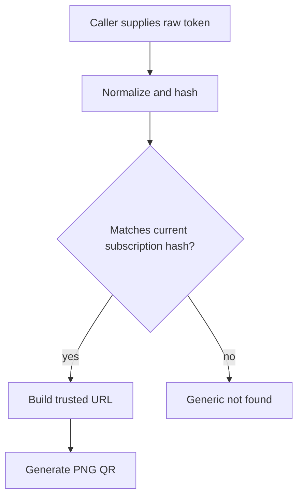

# QR Security

QR Codes generated by Task 34 contain credentials:

- subscription URL QR contains the opaque bearer token URL;
- VLESS QR contains a full VPN client configuration URI.

Treat QR images like secrets.

## Safety Properties

- QR generation is local with ZXing. No third-party generator is called.
- No arbitrary payload QR endpoint exists.
- No public QR endpoint is exposed by default.
- QR bytes are not stored.
- Raw subscription tokens are not stored.
- VLESS URIs are not stored.
- Tokenized paths are not added to public QR URLs.
- Filenames do not include tokens, Telegram ids, user ids, client UUIDs, or VLESS URIs.
- Responses use no-store caching and `X-Content-Type-Options: nosniff`.

## Token Validation

Subscription URL reveal and QR generation require the caller to provide the raw token. The service normalizes and hashes the token, then compares it with the stored hash. A wrong token does not reveal whether it belongs to another subscription.

After token rotation, old-token QR generation fails. After revocation, QR generation fails.

## Logging

Logs may include safe ids, payload type, format, size, config index, and trace id. Logs must not include raw token, token hash, subscription URL, VLESS URI, QR bytes, public key, private key, client UUID, cookies, or payment data.

