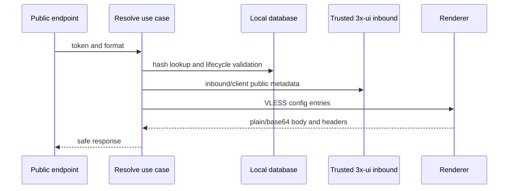
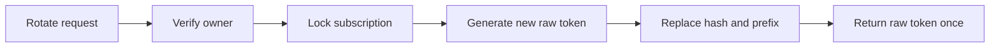
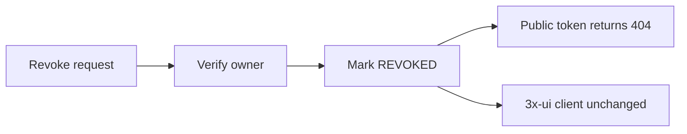

# Subscription API

Task 33 exposes internal subscription management endpoints and one public content endpoint. Examples use fake values.

## Internal Endpoints

Create:

```http
POST /internal/users/123456/subscriptions
Content-Type: application/json

{"xuiClientProvisionId":"11111111-1111-1111-1111-111111111111"}
```

First response includes the raw token once:

```json
{
  "subscriptionId": "22222222-2222-2222-2222-222222222222",
  "status": "ACTIVE",
  "accessToken": "sub_fakeTokenValueForDocsOnly",
  "subscriptionUrl": "https://subscriptions.example/sub/sub_fakeTokenValueForDocsOnly",
  "tokenVersion": 1,
  "newlyCreated": true
}
```

Replay response omits token fields:

```json
{
  "subscriptionId": "22222222-2222-2222-2222-222222222222",
  "status": "ACTIVE",
  "tokenVersion": 1,
  "newlyCreated": false
}
```

Other internal endpoints:

- `GET /internal/users/{telegramUserId}/subscriptions`
- `GET /internal/users/{telegramUserId}/subscriptions/{subscriptionId}`
- `POST /internal/users/{telegramUserId}/subscriptions/{subscriptionId}/rotate-token`
- `POST /internal/users/{telegramUserId}/subscriptions/{subscriptionId}/revoke`

Metadata endpoints never return the token hash or VLESS content. Rotation returns the new raw token once. Revocation does not mutate payment, order, or remote 3x-ui client state.

## Public Endpoint

```http
GET /sub/sub_fakeTokenValueForDocsOnly
GET /sub/sub_fakeTokenValueForDocsOnly?format=plain
GET /sub/sub_fakeTokenValueForDocsOnly?format=base64
```

Default format is Base64. Successful responses use `text/plain; charset=utf-8`.

Status behavior:

- `200`: valid active subscription rendered;
- `404`: malformed, unknown, suspended, revoked, expired, or inaccessible token;
- `503`: valid active subscription cannot be rendered due to temporary trusted metadata failure.

## Content Generation Flow



## Rotation Flow



## Revocation Flow



