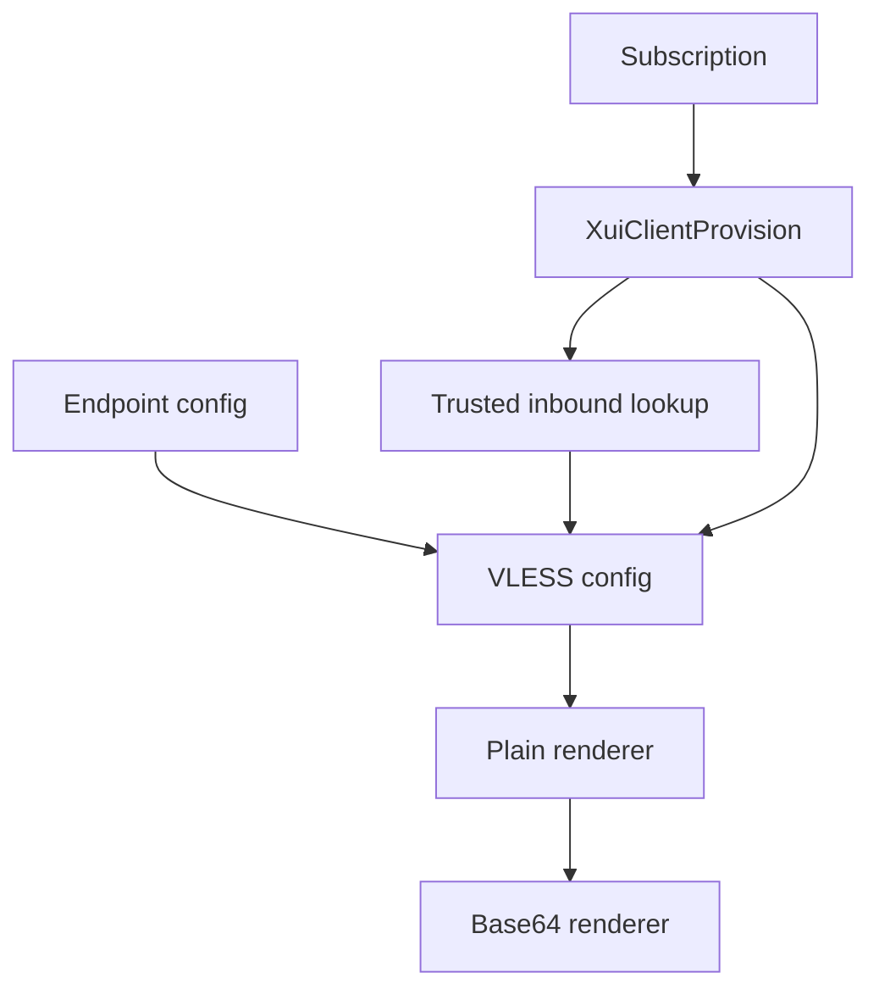

# Subscription Content

Task 33 renders subscription content dynamically from trusted local provision state, trusted endpoint configuration, and 3x-ui inbound metadata. It does not store full generated VLESS links.

## Trusted Field Sources

- client UUID: `XuiClientProvision.remoteClientId`;
- inbound id: `XuiClientProvision.inboundId`;
- expiry and traffic limits: provision and remote client metadata where reliable;
- public host/base URL: subscription configuration;
- VLESS/REALITY public fields: trusted inbound discovery via `XuiInboundClient`.

Public requests never supply host, SNI, public key, short id, protocol, transport, port, client UUID, or user id.

## VLESS + REALITY

The minimum supported profile is VLESS + REALITY + TCP. xHTTP fields are supported by the model/builder when the discovered inbound supplies them. The URI builder uses deterministic query parameter order and UTF-8 percent encoding.

Reality public key (`pbk`) may be included. Reality private key is never part of the subscription model, API responses, logs, or generated content.

## Plain And Base64 Formats

Plain format is one URI per line with UTF-8 text. Base64 format is the Base64 encoding of the complete plain UTF-8 content with no wrapping. The default format is Base64 for broad client compatibility.

## Headers

Responses use `text/plain; charset=utf-8`, no-store caching headers, `X-Content-Type-Options: nosniff`, and inline disposition. Optional client headers include `subscription-userinfo`, `profile-title`, `profile-update-interval`, and `support-url` when trusted values are configured and sanitized.

Usage metadata is optional. If remote traffic stats cannot be obtained, content rendering can still succeed without claiming unavailable values.

## Fallback

If trusted inbound metadata cannot be fetched and there is not enough local public snapshot data, a valid active subscription returns `503`. The service does not fabricate public keys, ports, or transport details.

