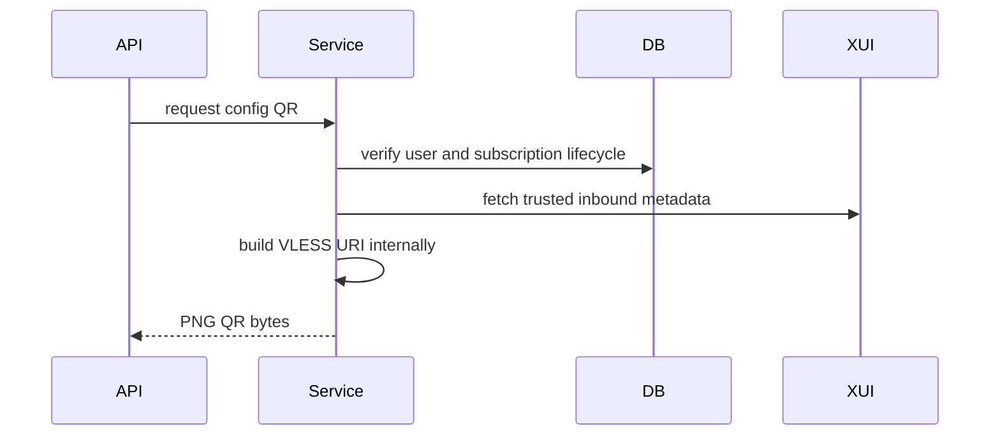

# Subscription Delivery API

All endpoints are internal and user-scoped.

Base path:

```text
/internal/users/{telegramUserId}/subscriptions/{subscriptionId}/delivery
```

## Summary

```http
GET /
```

Returns safe delivery metadata: plan name, status, token prefix, config count, and display-safe config entries. It does not return the raw token, subscription URL, VLESS URI, token hash, private key, or 3x-ui credentials.

## Subscription URL

```http
POST /subscription-url
Content-Type: application/json

{"accessToken":"sub_fakeTokenForDocsOnly"}
```

The raw token is validated against the stored hash. The URL is built from configured `app.subscription.public-base-url`, not request headers.

## Subscription URL QR

```http
POST /subscription-url/qr
Content-Type: application/json

{
  "accessToken": "sub_fakeTokenForDocsOnly",
  "format": "PNG",
  "size": 512,
  "marginModules": 4,
  "errorCorrection": "MEDIUM"
}
```

Returns `image/png` with no-store cache headers and a token-free filename.

## Config Entry

```http
GET /configs/1
```

Returns one internally rendered VLESS URI for trusted internal delivery. The URI is a client credential and must not be logged or cached.

## Plain And Base64 Content

```http
GET /content?format=plain
GET /content?format=base64
```

Returns the full rendered subscription content for the authenticated internal user. Default format is Base64. Responses use `text/plain; charset=utf-8` and no-store headers.

## Config QR

```http
GET /configs/1/qr?format=PNG&size=512&marginModules=4&errorCorrection=MEDIUM
```

Returns a QR image for the selected VLESS URI. Indexing is one-based.

## Lifecycle Errors

Revoked, suspended, expired, invalid, wrong-owner, disabled-provision, or deleted-provision subscriptions cannot produce usable delivery output. Temporary trusted metadata failure returns a service-unavailable style error.


