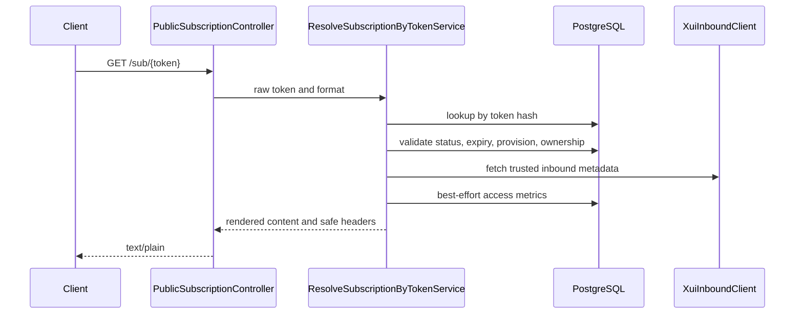
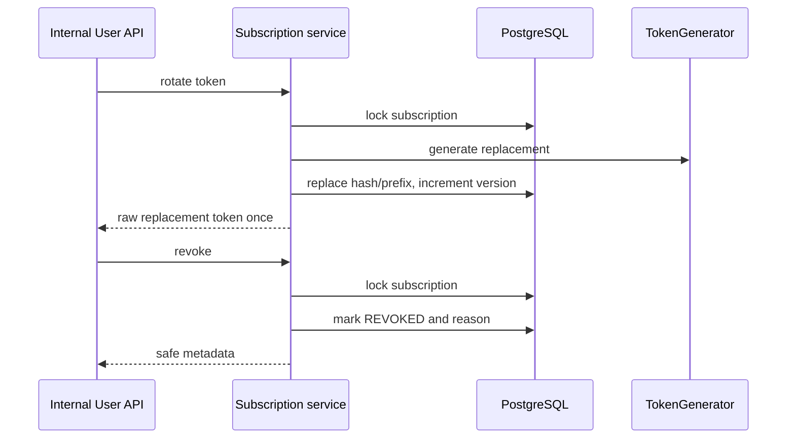
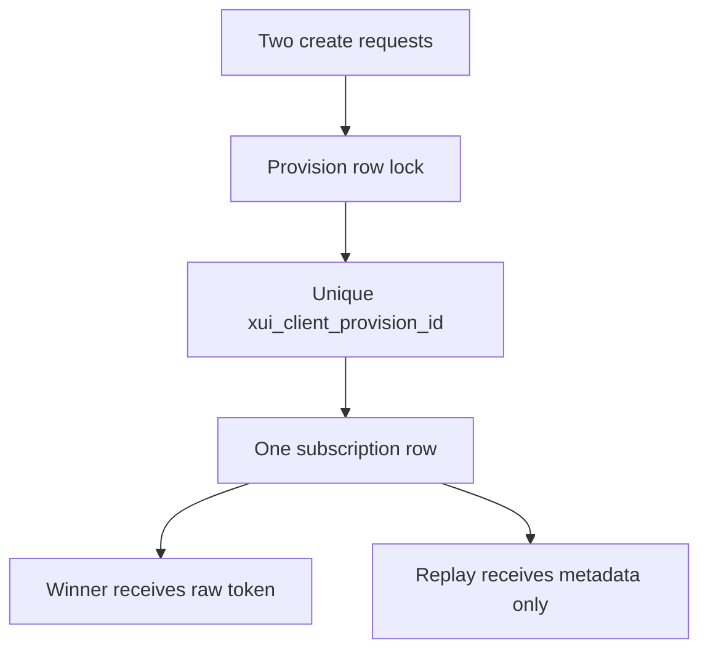

# Subscription Domain

Task 33 introduces `Subscription` as the local access aggregate for a successfully provisioned 3x-ui client. A subscription belongs to one `User`, one `Order`, one `PlanSelection`, and one `XuiClientProvision`. It also records the trusted inbound id and remote client UUID that were already produced by provisioning.

Subscription access is separate from VPN connectivity. Revoking or suspending a subscription prevents config retrieval through `/sub/{token}`. It does not delete, disable, renew, or recreate the remote 3x-ui client.

## Lifecycle

States are `PENDING`, `ACTIVE`, `SUSPENDED`, `REVOKED`, `EXPIRED`, and `INVALID`. Task 33 creates subscriptions directly as `ACTIVE` after validating that the underlying provision is `ACTIVE`. `REVOKED`, `EXPIRED`, and `INVALID` are terminal for public token access.

`expiresAt` is copied from trusted provision expiry when available. A subscription must not outlive the provisioned client. On public access, expired active/suspended subscriptions are reconciled to `EXPIRED` in a short local transaction.

## Ownership

Creation and rendering validate that:

- subscription user matches provision user;
- subscription plan selection matches provision plan selection;
- order belongs to the same user and plan selection;
- provision is active and not deleted;
- inbound id and remote client UUID match trusted local/remote state.

Invalid linkage is not repaired automatically. Public callers receive a generic unavailable response.

## Create Flow

```mermaid
sequenceDiagram
    participant Internal as Internal API
    participant Create as CreateSubscriptionService
    participant DB as PostgreSQL
    participant Token as TokenGenerator
    Internal->>Create: provision id
    Create->>DB: lock/load XuiClientProvision
    Create->>DB: validate user, order, plan selection
    alt existing subscription
        Create-->>Internal: metadata, no raw token
    else no subscription
        Create->>Token: generate raw token, hash, prefix
        Create->>DB: insert Subscription
        Create-->>Internal: metadata plus raw token once
    end
```

## Public Resolution Flow



## Rotation And Revocation



## Concurrency



