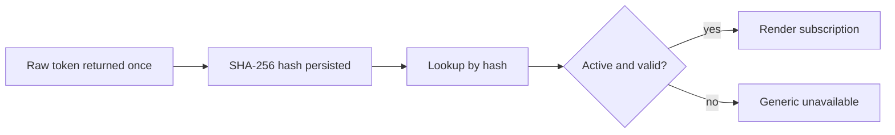

# Subscription Security

The public subscription endpoint is protected only by possession of an opaque bearer token. It intentionally has no user login in Task 33, so token secrecy is the access control.

## Token Model

Tokens use the format `sub_<random>`, where the random component is URL-safe Base64 without padding. The generator uses `SecureRandom` with at least 32 bytes of entropy. Tokens contain no user id, Telegram id, provision id, order id, timestamp, or sequential component.

Only a SHA-256 hash of the normalized raw token is persisted. SHA-256 is appropriate here because these are high-entropy machine-generated secrets, not human passwords. Lookup is deterministic and fast, and the raw token is returned only at creation or explicit rotation time.

## Hash At Rest

The `subscriptions.access_token_hash` column stores a 64-character lowercase hex hash. The hash is unique. Token matching uses the complete normalized token and constant-time byte comparison for the computed hash.

`accessTokenPrefix` is stored only for safe operator lookup. It is not sufficient for authentication and must not be treated as a secret.

## Replay, Rotation, Revocation

Creation is idempotent by `xuiClientProvisionId`. The first create response includes the raw token; replay returns metadata with no raw token because the token is not stored.

Rotation replaces the token hash immediately on commit and increments `tokenVersion`. Rotation is intentionally not idempotent in Task 33; clients must not blindly retry after an unknown result.

Revocation is idempotent for an already revoked subscription. Revoked, expired, and invalid subscriptions cannot render public content.

## Logging And Redaction

Logs must not contain raw tokens, token hashes, complete subscription URLs, complete VLESS URLs, 3x-ui cookies, panel credentials, payment data, or Reality private keys. Public subscription failures use the redacted path template `/sub/{redacted}`.

## Enumeration Protection

The public endpoint returns the same unavailable behavior for malformed, unknown, revoked, suspended, and expired tokens. It does not reveal whether a token used to be valid. A valid active subscription that cannot be rendered due to trusted remote metadata failure returns `503`.

## HTTPS And Proxy Logs

`app.subscription.public-base-url` should be HTTPS outside local development. Reverse proxies and access logs must redact `/sub/{token}` paths before storage.

