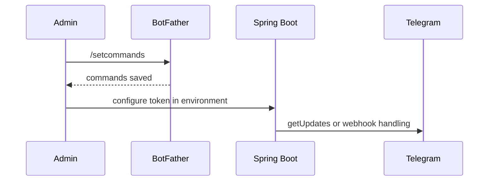

# BotFather Setup

Use BotFather only to configure Telegram profile metadata and command hints. Backend behavior is implemented by the Spring Boot application.

1. Open `@BotFather`.
2. Run `/setname` and choose the bot.
3. Set a customer-facing Persian name, for example `فروشگاه VPN`.
4. Run `/setdescription` and set a short description of purchase and service management.
5. Run `/setabouttext` and set a shorter one-line summary.
6. Run `/setuserpic` and upload the production-approved bot avatar.
7. Run `/setcommands`, choose the bot, and paste `docs/telegram/botfather-commands.txt`.

Do not commit the bot token. Keep `TELEGRAM_BOT_TOKEN` and `TELEGRAM_BOT_CALLBACK_SIGNING_SECRET` in deployment secrets.

Long polling is the default local mode. Webhook mode requires a public HTTPS endpoint and the configured webhook secret token.

