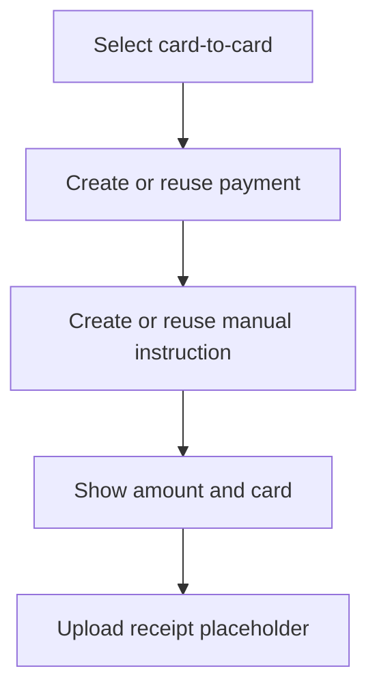

# Manual Payment UX

Manual card payment reuses the existing manual-payment domain and instruction issuance.

The Telegram message displays:

- Order base amount
- Exact payable amount including the reserved suffix
- Destination card
- Card holder
- Instruction expiry

Copy buttons use Telegram inline `copy_text` when supported by the client library and adapter. The copied amount/card values are not stored in callback data and are not used as metrics labels.

Receipt upload is intentionally not reimplemented in Task 44. The current button returns a safe in-bot unavailable message without changing payment state.

Home and Back do not cancel a payment. Explicit cancellation remains a separate destructive action.
