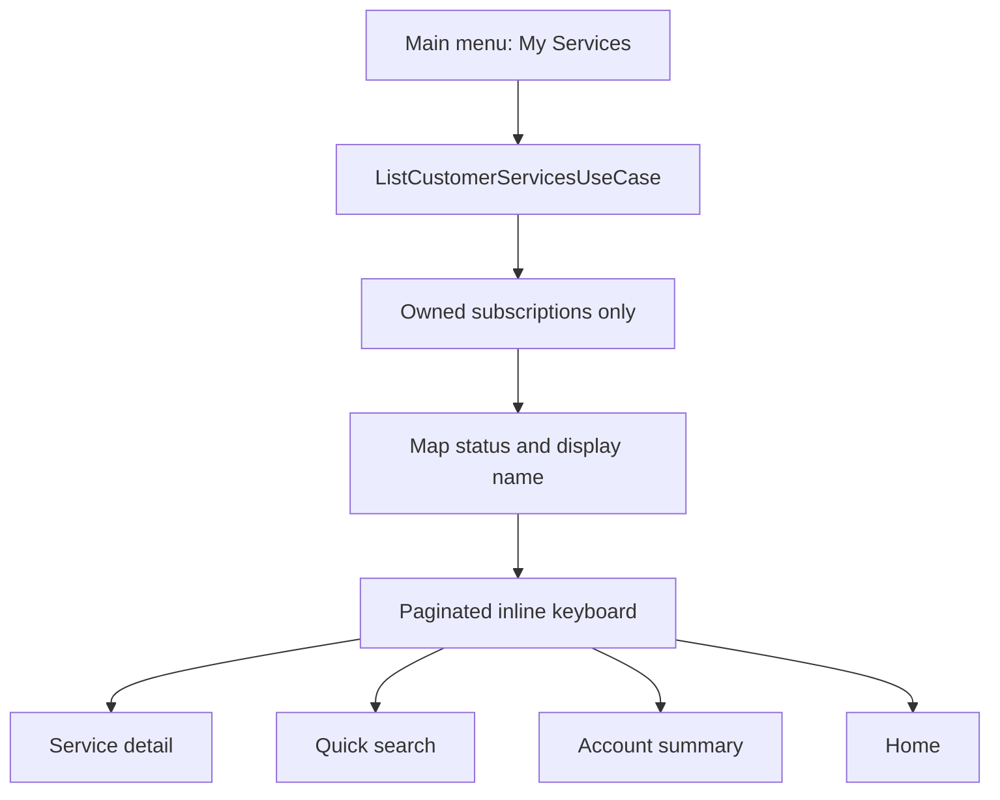

# My Services

Task 43 redesigns `🛍 سرویس‌های من` and `/subscriptions` as a customer service list.

The list is read-only and uses the customer service query port. Telegram handlers do not query repositories directly and do not talk to 3x-ui.

Ordering:

1. Active services.
2. Provisioning services.
3. Suspended services.
4. Expired services.
5. Failed or unknown services.
6. Revoked services.

The page size is configured with `app.telegram.customer-services.page-size` and bounded by `max-page-size`.

Visible service buttons use customer-safe names:

- trusted XUI remote email when it is intentionally a username and not an email address;
- persisted subscription display name;
- plan-name fallback.

Internal subscription IDs are carried only inside signed, expiring callbacks and are never shown in text.
