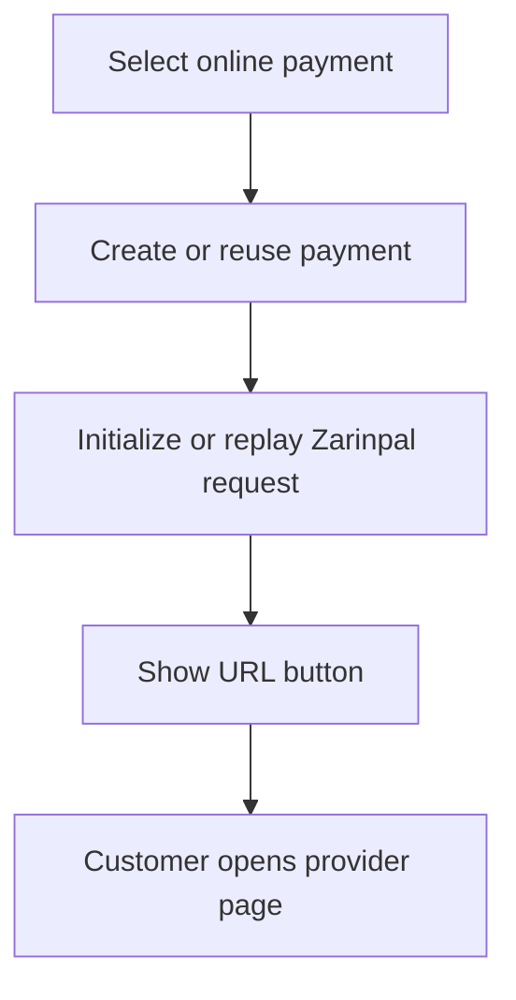

# Online Payment UX

Online payment reuses the existing Zarinpal initialization flow.

The bot displays a URL button for the provider payment page. Callback data never contains the URL or authority.

The message does not expose:

- Merchant ID
- Authority
- Raw provider response
- Internal payment ID

Duplicate callback delivery reuses existing payment/provider request state where the underlying payment flow supports idempotency.
