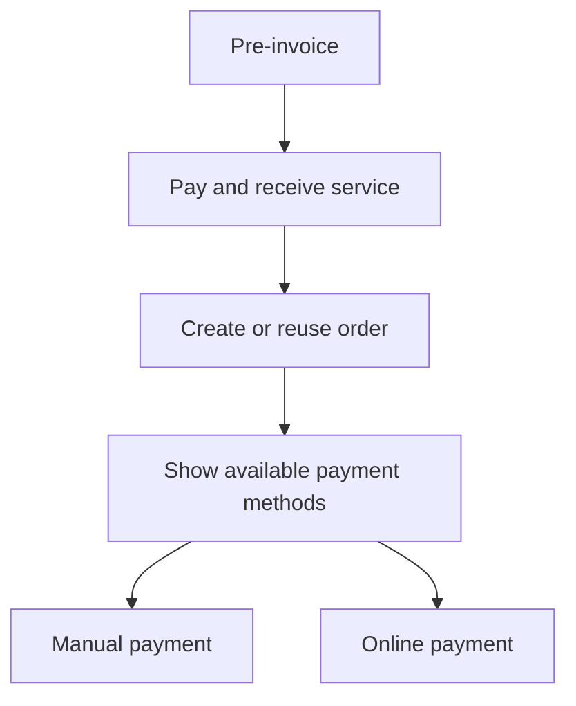

# Payment Method Selection

The payment-method page is shown only after the customer accepts the pre-invoice.

Viewing the payment-method page does not create a `Payment`.

Available buttons are feature-aware. Disabled or unconfigured providers are not advertised. If no method is available, the bot shows a localized unavailable message and does not mutate financial state.

Callback data carries only signed resource references. It does not carry amount, price, currency, card number, provider URL, provider authority, wallet values, or discount values.
