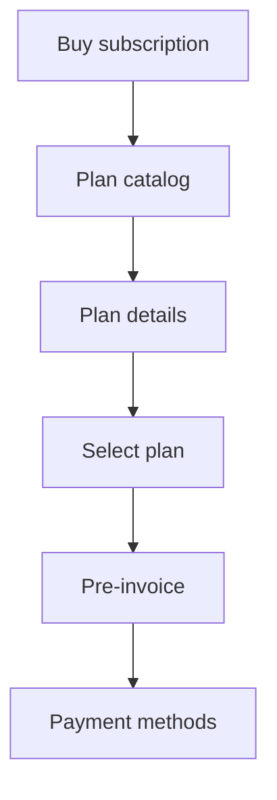

# Purchase Pre-Invoice

Task 44 adds a customer-facing pre-invoice between plan selection and payment.

The pre-invoice is rendered from the trusted `PlanSelection` snapshot:

- Plan name, duration, traffic, device count, currency, and amount come from the snapshot.
- Current plan availability is rechecked before order creation.
- Discount and Wallet rows are omitted while those domains are not implemented.
- The visible Telegram text never includes plan selection IDs, order IDs, payment IDs, or callback signatures.

Order creation is delayed until the customer presses “pay and receive service”.

Price changes after a `PlanSelection` do not mutate the pre-invoice or an existing order. A new purchase session receives the new plan price.

Expired pre-invoices are not revived. The user is routed back to plan selection.
