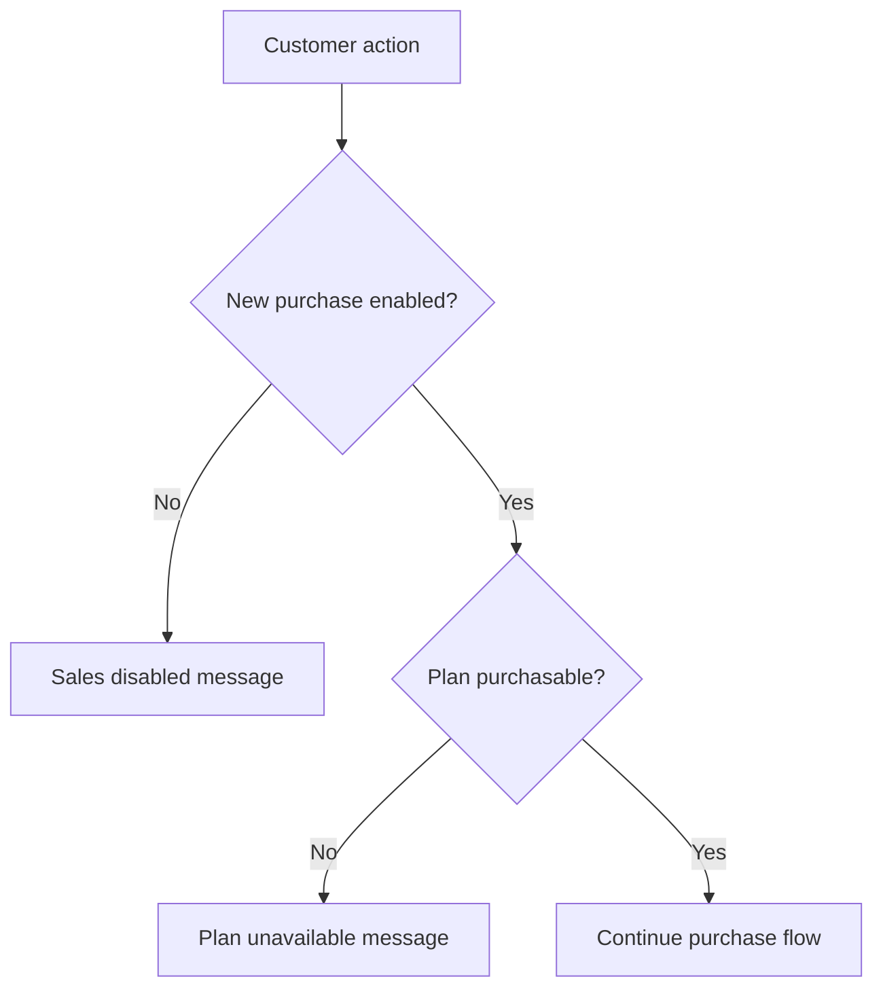

# Sales Controls

Sales switches are configured under `app.sales`.

Task 44 actively supports:

- `NEW_PURCHASE`
- `MANUAL_PAYMENT`
- `ONLINE_PAYMENT`

Future capabilities are exposed as availability states but remain disabled:

- Renewal
- Trial
- Wallet payment
- Discount code
- Gift code

Payment methods require both the sales flag and a working provider:

- Manual payment: `SALES_MANUAL_PAYMENT_ENABLED=true`, `MANUAL_CARD_PAYMENT_ENABLED=true`, and a registered card-to-card processor.
- Online payment: `SALES_ONLINE_PAYMENT_ENABLED=true`, `ZARINPAL_ENABLED=true`, and a registered Zarinpal processor.

Sales disabled policy:

- Before order creation: no order or payment is created.
- After order creation but before payment creation: no new payment is created while sales are disabled.
- After payment creation: the existing payment remains accessible according to normal payment expiry/cancellation rules.
- After approval: provisioning continues.

Changing these flags currently follows normal Spring configuration behavior and may require an application restart.
