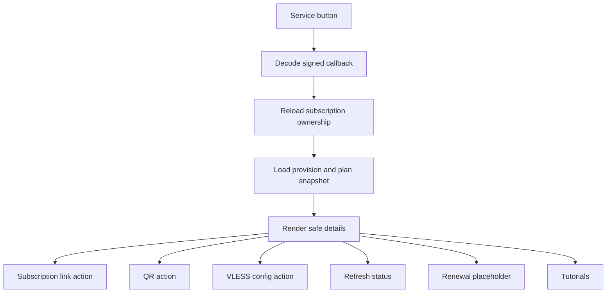

# Service details

Service details are opened from My Services, search results, or older signed `VIEW_SUBSCRIPTION` callbacks.

Displayed fields:

- customer-safe service name;
- plan snapshot name;
- customer-facing status;
- total, used, and remaining traffic when reliable usage exists;
- expiry date;
- remaining time.

Status labels:

- `🟡 در حال ساخت`
- `🟢 فعال`
- `🟠 تعلیق‌شده`
- `⚫ منقضی‌شده`
- `🔴 لغوشده`
- `❌ خطای ساخت`
- `❔ نامشخص`

Delivery policy:

- Subscription link uses the existing secure rotation-warning flow. A new raw token is not generated automatically.
- QR delivery reuses the existing QR generation use cases.
- VLESS config delivery reuses the existing config-entry use case.
- Revoked, failed, provisioning, and unknown services do not show delivery buttons.

Renewal remains a localized unavailable placeholder in Task 43.
