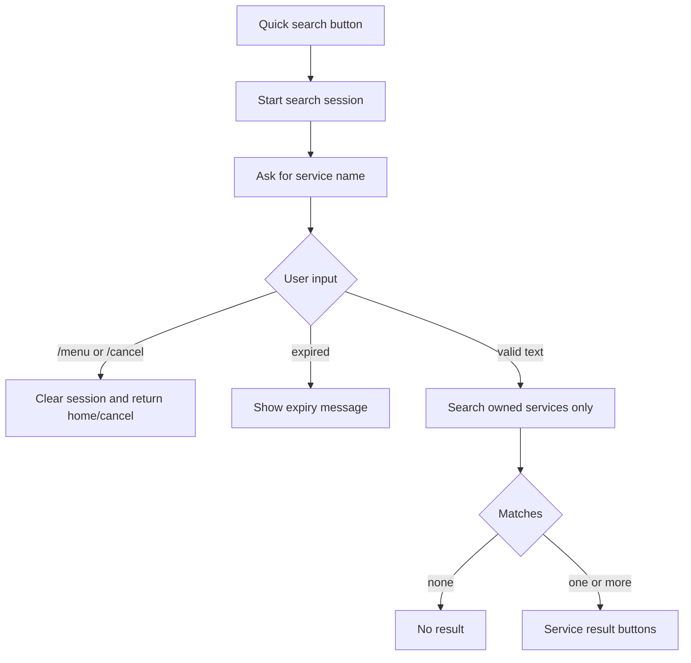

# Service search

Quick search is started from My Services with `🔎 جست‌وجوی سریع`.

Search state is a short-lived Telegram UI state held in memory. It does not mutate subscriptions, payments, orders, or provisioning state.

Search rules:

- Minimum length defaults to 3 characters.
- Maximum length defaults to 64 characters.
- Matching is exact, prefix, then contains.
- No fuzzy search is used.
- Search is always scoped to the current Telegram user.
- Search query text is not logged.

Persian/Arabic character normalization reuses the Task 41 Telegram button normalizer.
