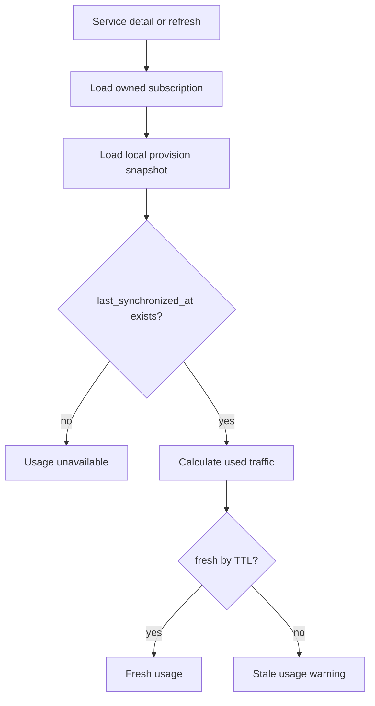

# Subscription usage display

Task 43 displays usage only when reliable local data is available on `XuiClientProvision`.

The Telegram service detail page does not call 3x-ui directly. The Refresh button reloads the local read model and keeps the page read-only.

Rules:

- Missing usage is shown as unavailable, never as zero.
- Remaining traffic is `max(total - used, 0)`.
- Unlimited traffic is displayed as unlimited when the plan snapshot has no traffic limit.
- Stale usage is clearly labelled.
- Negative values are rejected in application result models.

Configuration:

- `app.telegram.customer-services.show-usage`
- `app.telegram.customer-services.usage-freshness-ttl`
- `app.telegram.customer-services.minimum-refresh-interval`

No subscription expiry, traffic limit, token, or remote client state is modified by the usage display.
