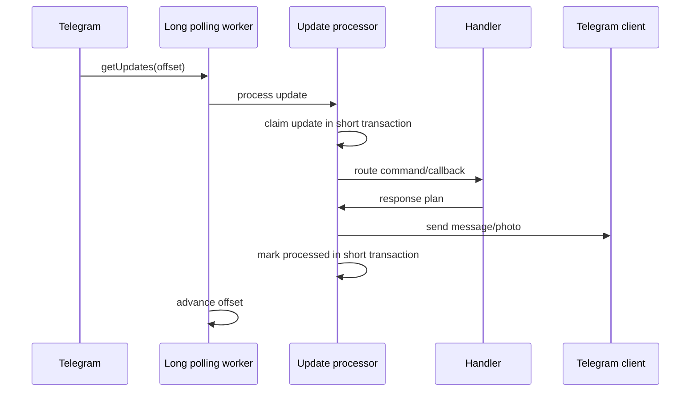
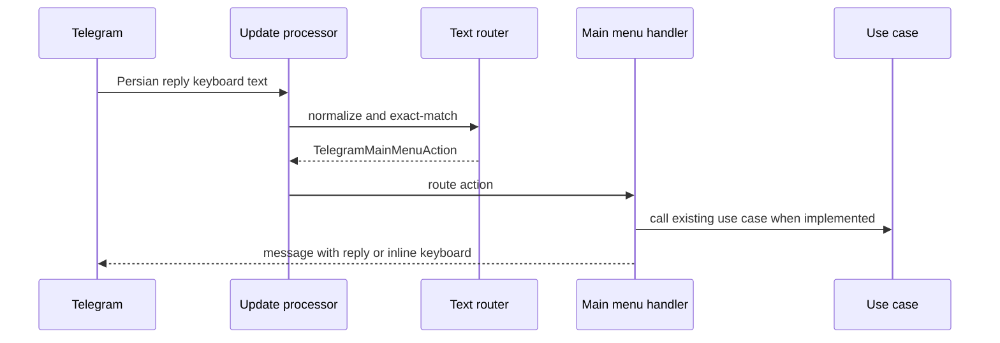
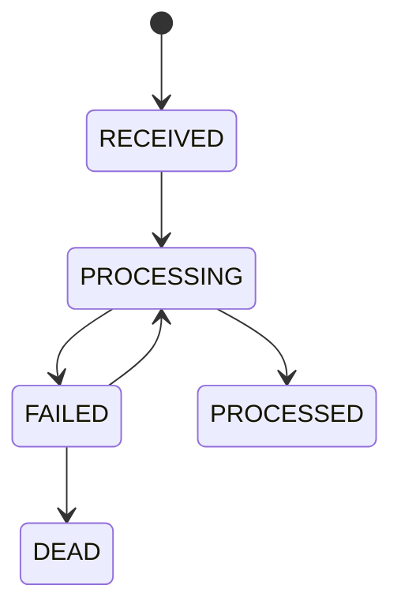

# Telegram Bot Architecture

Task 35 implements long polling as the only active update delivery mode. Webhook support is deferred.

The application and domain layers use internal Telegram models only. Telegram HTTP DTOs and `RestClient` stay in infrastructure.

## Task 41 Menu Routing

The persistent main menu is a Telegram application concern. Domain services do not depend on menu actions, page models, or keyboard classes.

## Idempotency

`telegram_processed_updates` stores one row per Telegram `update_id`. A processed update is terminal and replay does not resend messages. Failed updates can be retried until the configured attempt limit, then become `DEAD`.

Telegram send operations do not provide a general caller idempotency key. A timeout after Telegram accepts a message is an uncertain result, so exactly-once outbound delivery is not claimed.

## Transactions

Update claim, completion, failure, polling offset updates, and sensitive-action completion are short database transactions. Telegram HTTP calls, QR rendering, and long-poll waits happen outside those transactions.
