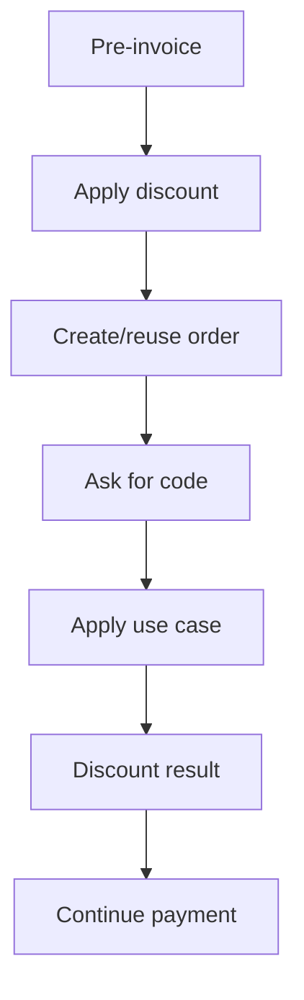

# Telegram Discount Codes

Discount entry is available from new-purchase and renewal pre-invoices.

The bot stores only the target order id in the temporary session. It does not store raw code text after processing and does not calculate prices in Telegram handlers.

Customer messages are generic for invalid codes and specific only for safe cases such as minimum amount or already-used code.

